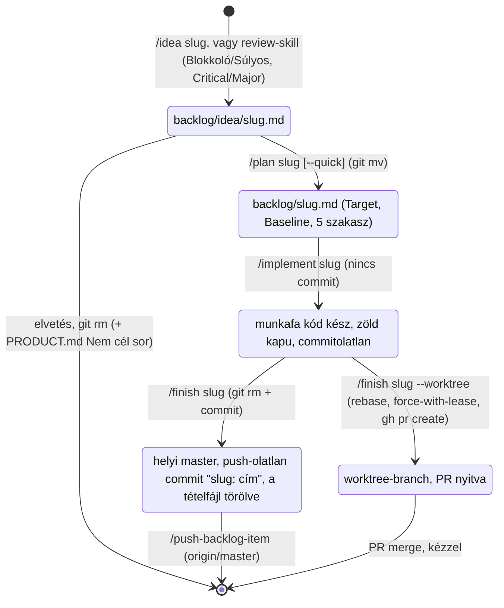

# A backlog-kezelési flow — fejlesztői leírás

Ez a fájl a fejlesztőnek (és egy későbbi review-agentnek) írja le, hogyan él egy tétel a
`backlog/` mappában az ötlettől a push-ig: melyik skill mit csinál, mit nem csinálhat, hol áll
meg, és melyik gépi őr mit fog meg. **Nem agent-context** (egyik `CLAUDE.md` sem tölti be), és
**nem tétel** — a `docs-check` és a `/backlog` a `CLAUDE.md`-vel együtt kihagyja.

Igazságforrások, ha ez a leírás és a valóság eltér: a skill *lépéseit* a `.claude/skills/*/SKILL.md`
és a `.claude/commands/push-backlog-item.md` mondja ki, a tétel *alakját* a `backlog/CLAUDE.md`,
a gépi szabályokat a `scripts/docs-check.mjs`. Ez a fájl a kettő közti szándékot és a köztük
talált feszültségeket rögzíti; skill-változásnál frissítendő.

---

## 1. A modell egy bekezdésben

Egy fájl = egy tétel, a fájlnév a kebab-case `slug`, ami az első sor (`# <slug>`) és minden
későbbi parancs azonosítója is. **A státusz a mappa:** `backlog/idea/<slug>.md` ötlet,
`backlog/<slug>.md` a gyökérben tervezett (implementálható). Nincs `Status:` sor, index, sorszám,
prioritás — a doki választ. Az állapotváltás egyetlen `git mv`; a kész tétel törlődik, nem
„done"-ra kerül; a történet a git history. Elvetett irány sem marad itt: egy sor a
`docs/PRODUCT.md` Nem cél szakaszába, „nem X, amíg Y" alakban.

| | `idea/<slug>.md` (ötlet) | `<slug>.md` a gyökérben (tervezett) |
|---|---|---|
| Kötelező fejléc | `# <slug>`, `Type:` | `# <slug>`, `Type:`, `Target: master`, `Baseline: <40 hex>` |
| Opcionális fejléc | `Source:`, `Kerdes:` | `Source:` (a `Kerdes:` törlődik, ha a tervezés megválaszolta) |
| Törzs | egy bekezdés | `## Goal / Current state / Approach / Decisions / Verification` |
| Budget | ≤ 1500 karakter | ≤ 6000 karakter |
| `Type` | `feature` · `bug` · `chore` · `doki` | `feature` · `bug` · `chore` (`doki` itt tilos) |

`Type` jelentése: `feature` új viselkedés; `bug` reprodukálható hiba; `chore` kód-housekeeping,
refactor, őr-erősítés; `doki` emberi teendő, adatmunka — mindig `idea/` alatt marad, sosem
tervezhető. A fejléc-kulcsok és a budgetek forrása:
→ symbol:scripts/docs-check.mjs#BACKLOG_HEADER_KEYS; symbol:scripts/docs-check.mjs#BACKLOG_BUDGET

---

## 2. Életciklus

Az ábrán minden nyíl egy skill vagy egy kézi git-parancs, és minden állapot egy megfigyelhető
fájlrendszer- vagy git-állapot. Két dolgot nem tesz meg egyik skill sem: nem commitolja a
tételfájlt a `/finish` előtt, és nem push-ol a `/push-backlog-item` (illetve a `--worktree` ág)
előtt.

---

## 3. A skillek szerződése

Mindegyiknél ugyanaz a hat mező. A lépések részletei a hivatkozott fájlban; itt csak az áll, amit
egy hívónak vagy egy reviewernek tudnia kell.

### `/idea <slug> [szöveg | forrás-fájl]`

- **Bemenet:** egy kebab-case slug, és vagy egy-két mondat, vagy egy forrás-fájl (pl. review-jelentés),
  vagy semmi (akkor a beszélgetés a forrás). Többötletes forrásnál a skill ötletenként javasol
  slugot, a felhasználó választ.
- **Előfeltétel — megáll, ha:** egy létező tétel (a két mappa slugjai vagy `Source:` sorai) már
  fedi a felvetést. Ha a felvetés a `docs/PRODUCT.md` Nem cél szerint elvetett irány vagy hard
  invariánst sért, kimondja, de a tétel felvehető — a bekezdés első mondata jelzi az ütközést.
- **Létrehoz/mozgat:** `backlog/idea/<slug>.md`, a teljes tartalom bemutatása és kifejezett
  jóváhagyás után.
- **Soha nem:** ír app-kódot, tervez, rangsorol, commitol. `Type: doki`-t felvesz, de az onnan
  nem megy tovább.
- **Hol áll meg:** a fájl lemezen, commitolatlanul. A záró jelentés mondja ki, hogy a következő
  commitba a doki teszi be (vagy a `/finish` viszi a tételével).
- **Következő:** `/plan <slug>`, egyértelmű bugnál `/plan <slug> --quick`.

→ file:.claude/skills/idea/SKILL.md

### `/plan <slug> [--quick]`

- **Bemenet:** egy létező `backlog/idea/<slug>.md`, vagy egy szabad felvetés (akkor a fájlt is ez
  hozza létre, az `/idea` dedup-lépésével).
- **Előfeltétel — megáll, ha:** a tétel `Type: doki`; a slug már a gyökérben van (újratervezéshez
  előbb ki kell mondani, mi bukott meg); írás előtt `git fetch` + `git pull --ff-only` divergenciát
  ad; `git ls-tree origin/master backlog/` ugyanazt a slugot már tervezettként mutatja (párhuzamos
  session). Előkészítésként kötelező olvasmány: `docs/PRODUCT.md` (Nem cél, Szándékos hiányok),
  a root `CLAUDE.md` hard invariánsai, az érintett nested `CLAUDE.md` és annak „Find before
  writing" indexe — ütközésnél explicit felveti, nem kerülgeti.
- **Létrehoz/mozgat:** interjú ág-onként (a legnagyobb hatású bizonytalanságtól, egy ág egyszerre,
  minden lezárt ág visszaismételve), majd `git mv backlog/idea/<slug>.md backlog/<slug>.md` és a
  fájl újraírása: `Target: master`, `Baseline: <git rev-parse HEAD írás előtt>`, `Goal / Current
  state / Approach / Decisions / Verification`. `--quick` csak `Type: bug`-nál, reprodukció +
  elvárt viselkedés birtokában: interjú nélkül, `Decisions: - nincs`; ha közben döntési ág bukkan
  fel, visszavált a normál interjúra. Két megerősítési pont: jelölt-választás (többötletes
  forrásnál) és a végleges fájltartalom.
- **Soha nem:** ír vagy módosít app-kódot (mintakódot, „illusztrációs" snippetet sem), nem ír
  függvényszignatúrát vagy típusdefiníciót, nem nyúl más backlog-fájlhoz, nem rangsorol, nem
  commitol. A tervfájlba nem ír olyat, amit később „meg akarna találni": a tartós context a
  `/finish` 4. lépésében kerül `PRODUCT.md`-be vagy nested `CLAUDE.md`-be.
- **Hol áll meg:** a tervfájl a gyökérben, commitolatlanul. Ha a helyi master előrébb jár az
  originnál, a záró jelentés kimondja.
- **Következő:** `/implement <slug>`.

→ file:.claude/skills/plan/SKILL.md

### `/implement <slug> [--worktree]`

- **Bemenet:** `backlog/<slug>.md` a gyökérben.
- **Előfeltétel — megáll, ha:** a fájl a gyökérben nincs meg (ha `idea/` alatt van, előbb `/plan`);
  `Type: doki`; a `git status` a feladathoz nem tartozó commitolatlan módosítást mutat (kérdez,
  nem épít rá, nem írja felül); a `git pull --ff-only origin master` divergencia miatt nem megy.
  Preflight: a `Baseline` és `git rev-parse origin/master` eltérésekor a `Current state` minden
  fájljára/symboljára/tesztjére megnézi, létezik-e még és változott-e; ha a plan valamely döntése
  emiatt nem áll meg, megáll és kérdez; egyébként a `Baseline` sort az aktuális SHA-ra írja.
- **Létrehoz/mozgat:** app-kódot és tesztet a plan `Approach` + `Decisions` scope-jában, a plan
  `Verification` `tests` tételét konkrét tesztnévvel, `.skip`/`.only` nélkül; új logika előtt a
  nested `CLAUDE.md` „Find before writing" indexét nézi. Utána a minőségi kapu az `app/` alatt
  mind zöldig: `npm run build`, `npm run lint`, `npm test`, `npm run docs-check` (0 hiba, allowlist
  helyett javítás).
- **Soha nem:** bővíti a scope-ot, nem kerekít le a planben el nem döntött irányba (ha a plan
  hibásnak bizonyul, megáll és kimondja), nem javít menet közben talált idegen hibát (az
  `/idea`-val vehető fel a jelentés után), **nem commitol**.
- **Hol áll meg:** zöld kapu után, commit nélkül. A jelentés: mi valósult meg a plan döntéseihez
  igazítva, a `Verification` mely tételei teljesültek, melyik manual-check szelet van hátra,
  push-olatlan commitok listája, ha volt.
- **Következő:** `/finish <slug>` (worktree-nél `/finish <slug> --worktree`).

→ file:.claude/skills/implement/SKILL.md

### `/finish <slug> [--worktree]`

- **Bemenet:** egy `/implement` után álló, kódszinten kész tétel; a lépések sorrendje kötelező,
  egyik sem ugorható.
- **Előfeltétel — megáll, ha:** a kapu (`build`, `lint`, `test`) vagy a `docs-check` piros és nem
  javítható; a plan `Verification` manual-check szelete (`pdf` | `visual-css` | `keyboard-a11y`)
  a tételhez tartozó találatot ad (javítás, kapu újra); `git fetch origin` után
  `git ls-tree origin/master backlog/<slug>.md` **nem** mutatja a fájlt („máshol lezárták").
- **Létrehoz/mozgat:** dokumentáció **csak ha kell** — a default „nincs docs-diff", és ezt a
  jelentés kimondja; ír, ha kódból és tesztből nem levezethető context keletkezett: termékszándék /
  nem-cél / jogi korlát → `docs/PRODUCT.md`; discovery vagy gotcha → az érintett nested `CLAUDE.md`,
  egy állítás egy sor, path-qualified anchorral, budgeten belül; új, ismétlődő helper → egy sor a
  „Find before writing" indexbe. Utána `git rm backlog/<slug>.md` (nincs stub, nincs napló), és
  commit a helyi masteren: első sor `<slug>: <cím>` (a `Goal` rövid alakja), törzs 1–2 mondat
  magyarul, a repó szokásos lábléce.
- **Soha nem:** push-ol, nem nyit PR-t, nem visz át tervfájl-tartalmat sehova, nem ír
  „döntések átvezetése" prózát vagy lezárt-tétel naplót, nem hívja automatikusan az
  `/update-changelog`-ot vagy `/update-features`-t.
- **Hol áll meg:** a commit után, a helyi masteren. A záró jelentés kötelező elemei: mi valósult
  meg; **számozott kézi tesztelési lista** a dokinak; a commit és a helyi masteren várakozó
  push-olatlan commitok listája; volt-e docs-diff és hol; a mondat „a commit a helyi masteren
  van, push-olatlan, kézi ellenőrzés után `/push-backlog-item`"; emlékeztető a két kézi
  docs-skillre.
- **Következő:** a doki kézi ellenőrzése, majd `/push-backlog-item`.

→ file:.claude/skills/finish/SKILL.md

### `/push-backlog-item`

- **Bemenet:** egy vagy több `/finish` által a helyi masteren hagyott, kézzel ellenőrzött commit.
  Nincs argumentum: ami `origin/master..HEAD`-ben van, az megy.
- **Előfeltétel — megáll, ha:** a `git status` bármilyen commitolatlan módosítást mutat; az aktuális
  branch nem `master`; `git fetch` után `origin/master..HEAD` üres (nincs mit push-olni).
- **Létrehoz/mozgat:** `git push origin master` — sima push, **soha nem force**. Ha nem
  fast-forward (az origin előrelépett): `git pull --rebase origin master`; tiszta rebase után újra
  push, a kapu **nem** fut újra (kimondott döntés); konfliktusnál megáll, a rebase-t félbehagyva
  hagyja (nincs `--abort`, nincs automatikus feloldás), a doki oldja fel és `git rebase
  --continue`-zik, és *ekkor* a kapu (`build`, `lint`, `test`) újra kötelező a push előtt.
- **Soha nem:** nyit branchet vagy PR-t, nem force-push-ol, nem nyúl commitolatlan módosításhoz.
- **Hol áll meg:** sikeres push után. A jelentés: mely tételek commitjai mentek fel (slug a commit
  első sorából), történt-e rebase, emlékeztető a két kézi docs-skillre, ha még nem futottak.
- **Következő:** nincs; a tétel útja itt ér véget.

→ file:.claude/commands/push-backlog-item.md

### `/backlog`

- **Bemenet:** nincs.
- **Előfeltétel:** nincs; csak olvas.
- **Létrehoz/mozgat:** semmit. Kimenet két tábla (`slug | Type | Kerdes ✓/– | első mondat`): előbb
  a gyökér (tervezett), aztán az `idea/` (tervezendő), a `Type: doki` sorok külön „Doki-teendők"
  alcím alatt; összesítés mappánként és típusonként; a gyökér tételeinél `baseline elmozdult`
  jelzés, ha a `Baseline` eltér a helyi `origin/master`-től (fetch nélkül — ez jelzés, a valódi
  drift-vizsgálat az `/implement` preflightja); hibás fejléc külön listában (ugyanazt a `docs-check`
  piros hibaként adja).
- **Soha nem:** módosít fájlt, nem fetchel, nem rangsorol, nem ad záró javaslatot arról, mit érdemes
  következőnek választani — a sorrend nem prioritás.
- **Hol áll meg:** a lista után.
- **Következő:** a doki választ.

→ file:.claude/skills/backlog/SKILL.md

---

## 4. Bemenetek: a review-skillek

Három review-skill közvetlenül ír `backlog/idea/<slug>.md` fájlt, az `/idea` megkerülésével, de az
`/idea` fájlalakjában és dedup-szabályával (`ls backlog backlog/idea`: azonos slug vagy azonos
`Source:` → nincs új fájl). Egyik sem módosít app-kódot, és egyik sem commitol.

- **`/doctor-review [scenario-slug]`** — István-persona bejárás izolált Chrome-ban, jelentés
  `docs/reviews/YYYY-MM-DD-doctor-review-<slug>.md`. Tételfájl minden `ÚJ` vagy `ISMÉT`
  dedup-címkéjű **Blokkoló** és **Súlyos** megállapításból: `Type: bug` (reprodukált hiba) vagy
  `feature` (hiányzó viselkedés), `Source: docs/reviews/<jelentés> N. megállapítás`; `MÁR TERVEZETT`
  találatnál semmi. `Közepes`/`Kis` a jelentésben marad, a doki `/idea`-val veszi fel. **A jelentés
  megmarad** — ez a következő futások dedup-forrása; csak a képernyőkép-mappa törölhető.
- **`/arch-react-review`** — architektúra + React lencse, jelentés
  `docs/reviews/YYYY-MM-DD-arch-react-review.md`, a korábbi jelentéssel összevetve
  (`NEW` / `CARRIED FORWARD` / `RESOLVED`). Tételfájl minden **Critical** és **Major**, `Status: NEW`
  megállapításból: `Type: bug` ha a viselkedés hibás, `chore` ha strukturális;
  `Source: docs/reviews/<jelentés> <finding id>`. `Minor` és `Observation` a jelentésben marad.
- **`/manual-checks <pdf | visual-css | keyboard-a11y | all>`** — a jsdom által strukturálisan nem
  fedett réteg izolált Chrome-ban, jelentés `docs/reviews/YYYY-MM-DD-manual-checks-<szelet>.md`.
  **Nem ír tételfájlt maga**: a valódi találat `/idea`-val vándorol a backlogba, utána a jelentés
  törölhető (átmeneti munkatermék). Egyértelmű, kicsi, célzott felület-szabály-sértést a menet
  részeként javíthat (zöld `npm test` + `tsc -b` + `oxlint` mellett) — ez az egyetlen review-skill,
  ami app-kódhoz nyúlhat. A flow másik pontján is szerepel: a `/finish` 3. lépése a plan
  `Verification` bejelölt szelete szerint hívja.

→ file:.claude/skills/doctor-review/SKILL.md; file:.claude/skills/code-and-architecture-review/SKILL.md; file:.claude/skills/manual-checks/SKILL.md

---

## 5. A gépi őr: `docs-check`

`npm run docs-check` az `app/` alól (vagy `node scripts/docs-check.mjs` a gyökérből), a CI-ban és
az `/implement` + `/finish` kapujában. A `backlog/` alatt rekurzívan minden `.md`-t átnéz, és a
státuszt az útvonalból dönti el: `backlog/idea/*.md` ötlet, `backlog/*.md` tervezett — kivéve a
`CLAUDE.md`-t és ezt a `README.md`-t. Bármely találat exit 1, allowlist nincs.

**Amit megfog (tételfájlon):**

- a fájlnév kebab-case slug, és az 1. sor pontosan `# <slug>`;
- a slug egyedi a két mappa között (egy tétel egy helyen él — az állapotváltás `git mv`, nem másolás);
- a fejléc (az első üres sorig) csak `Type`, `Source`, `Kerdes`, `Target`, `Baseline` kulcsot
  tartalmaz — `Status:` sor hiba;
- `Type` a négy érték egyike; a gyökérben `doki` tilos;
- a gyökérben `Target: master`, `Baseline: <40 hex>` és az öt `##` szakasz kötelező; `idea/` alatt
  `Target`/`Baseline` tilos;
- budget: idea ≤ 1500, tervezett ≤ 6000 karakter (kódpontban);
- minden fájlon (a README-n is): nincs D-szám / DP-szám hivatkozás, nincs legacy-dokumentumra mutató
  útvonal.

**Amit nem fog meg:** a tételfájlok `Current state` pointereit nem oldja fel — a tervek elavulását
az `/implement` baseline-preflightja fogja, nem az őr; szemantikai igazságot (helyes-e a `Goal`,
teljes-e a `Verification`) nem bizonyít. A path-qualified anchorokat (nyíl után `file:`,
`symbol:`, `test:` vagy `product:` típussal) csak a context-fájlokban (`CLAUDE.md`-k, `docs/PRODUCT.md`) és ebben a README-ben oldja fel — ezért a fenti
skill-hivatkozások átnevezésnél pirosat adnak, a szöveg tartalmi elavulása viszont nem.

→ symbol:scripts/docs-check.mjs#backlogStatus; symbol:scripts/docs-check.mjs#backlogTetel

---

## 6. A `--worktree` ág (párhuzamos sessionök)

Alapértelmezés: minden a helyi `master`-en, worktree és PR nélkül — egy session-re való. A
`--worktree` akkor kell, ha két session párhuzamosan dolgozik két tételen.

- **`/implement <slug> --worktree`:** az 1. lépés (validáció) a fő könyvtárban fut; utána
  `EnterWorktree` — friss branch `origin/master`-ről `.claude/worktrees/<slug>` alatt, vagy belépés a
  már létezőbe (állapot-felmérés, félbehagyott rebase kezelése). Onnantól kizárólag a worktree-ben:
  `cd app && npm install` az első teszt előtt; a ff-only pull kimarad (a branch az originról indult);
  preflight, implementáció, kapu változatlan. `ExitWorktree`-t nem hív.
- **`/finish <slug> --worktree`:** az 1–5. lépés a worktree-ben; a 6. lépés helyett: commit a
  branchen; `git fetch origin` + `git rebase origin/master` (konfliktusnál megáll, a rebase félbe
  marad, a doki oldja fel és újra `/finish --worktree`, ilyenkor a kapu újra fut);
  `git push --force-with-lease` (mindig ezzel, első pushnál is); `gh pr view`, ha nincs PR:
  `gh pr create --base master --title "<slug>: <cím>"`; ha a `gh` hiányzik, a push fusson, a PR
  kézi. `ExitWorktree`-t nem hív — a worktree sorsa a dokié.
- **`/push-backlog-item`** erre az ágra **nem** vonatkozik: az kizárólag a helyi master
  push-olására való, a worktree-ág a PR-en zár.

---

## 7. Lezárás után, kézzel

- **`/update-changelog`** — laikus nyelvű, dátumozott `docs/CHANGELOG.md`-bejegyzés a dokinak és az
  asszisztensnek; a dátum a commit dátuma, nem a futásé; csak a doki számára látható változásról;
  megerősítés után ír. **`/update-features`** — a `docs/FEATURES.md` képernyőnkénti pillanatképét
  írja újra a forráskód statikus olvasásából, megerősítés után. Mindkettő **külön, kézi hívás**:
  a `/finish` és a `/push-backlog-item` csak emlékeztetőt ír rájuk, sosem futtatja őket — egy
  doki-látható funkció több commitot is átfoghat, és a bejegyzés akkor jó, ha egyben születik.
- **Elvetés.** Ötlet, amit nem csinálunk meg: `git rm backlog/idea/<slug>.md`. Ha az elvetés
  termékszintű (nem csak „most nem"), egy sor a `docs/PRODUCT.md` Nem cél szakaszába, „nem X, amíg Y"
  alakban — ez a dedup egyik forrása, az `/idea` és a `/plan` ellene ellenőriz. Tervezett tétel
  elvetése ugyanez a gyökérből; a történet a git history.
  → product:#nem-cel

---

## 8. Egy tétel útja (fiktív `pelda-slug`)

| # | Parancs | Fájlrendszer | git | Megáll? |
|---|---|---|---|---|
| 1 | `/idea pelda-slug "A doki…"` | `backlog/idea/pelda-slug.md` létrejön (`Type`, `Source`, egy bekezdés) | untracked fájl; nincs commit | jóváhagyásnál, írás előtt |
| 2 | `/plan pelda-slug` | interjú → `git mv` → `backlog/pelda-slug.md`, benne `Target`, `Baseline`, 5 szakasz | `git fetch` + ff-only; nincs commit | ág-onként, és a végleges tartalomnál |
| 3 | `/implement pelda-slug` | `app/src/**` kód + teszt; `Baseline` frissül, ha drift volt | ff-only pull; kapu zöld; **nincs commit** | ha idegen módosítás van; ha a plan feltevése megdőlt |
| 4 | *(doki)* megnézi a munkafát | — | — | — |
| 5 | `/finish pelda-slug` | manual-check szelet, ha a plan kéri; docs csak ha nem levezethető; `backlog/pelda-slug.md` törlődik | commit `pelda-slug: <cím>` a helyi masteren; **nincs push** | kapu piros; origin-őr; konkurencia |
| 6 | *(doki)* kézi teszt a jelentés számozott listája szerint | — | — | — |
| 7 | `/push-backlog-item` | — | `git push origin master`; nem-ff esetén `pull --rebase` | commitolatlan módosítás; nem master; rebase-konfliktus |
| 8 | `/update-changelog`, `/update-features` — ha doki-látható a változás | `docs/CHANGELOG.md`, `docs/FEATURES.md` | (a doki commitolja) | megerősítésnél |

Bug-sáv: a 2. lépés `/plan pelda-slug --quick`, interjú nélkül. Párhuzamos session: a 3. és 5. lépés
`--worktree`-vel, a 7. lépés helyett PR.

---

## 9. Tervezési elvek

| Elv | Miért | Kikényszeríti |
|---|---|---|
| A státusz a mappa, nincs `Status:` sor | két igazságforrás (sor + hely) szétcsúszna; a `git mv` atomi | `docs-check` fejléc-szabály; `/plan` `git mv`; `/backlog` az útvonalból olvas |
| Fájl = tétel, slug = azonosító, nincs sorszám/index | az index karbantartása és a számláló konfliktus forrása; a slug beszédes és egyedi | `docs-check` slug-egyediség a két mappa között; minden skill `<slug>` argumentumot vár |
| Ötlet és terv sosem ír app-kódot | a tervezés ne kerekítse le a döntést kódban; a „mintakód" is döntés | `/idea` és `/plan` Korlátok szakasza |
| `/plan` interjúzik, nem feltételez; ütközést explicit felvet | a hard invariánsok és a Nem cél nem tárgyalási alap, de csendben sem kerülhetők | `/plan` Előkészítés 2., Hogyan dolgozz |
| `/implement` a plan scope-ját implementálja, nem bővíti; idegen hiba `/idea` | a scope-kúszás a review és a commit olvashatóságát rontja | `/implement` 4. |
| `/implement` nem commitol | a doki előbb a munkafát nézi meg, a commit már lezárás | `/implement` 6.; `/finish` 6. |
| Push kézi és külön parancs | a helyi master a „kézzel ellenőrizve" kapu; a push visszafordíthatatlan | `/finish` 6. megáll; `/push-backlog-item` sima push, soha force |
| Kész tétel törlődik, nincs napló, nincs „done" mappa | a git history a történet; egy lezárt-lista két helyen élne | `/finish` 5.; `docs-check` legacy-ref szabály (a régi „done"-mappa útvonala tiltott minta) |
| Nincs rangsor, a doki választ | az agent ne priorizáljon a doki helyett; a sorrend nem jelentés | `/backlog` nem ad javaslatot; `/idea`, `/plan` nem rangsorol |
| Dedup a két mappa slugjai, a `Source:` sorok és a Nem cél ellen | egy fájdalom egy tétel; elvetett irány ne térjen vissza észrevétlen | `/idea` 2., `/plan` 3., review-skillek Lezárása |
| `Baseline` + preflight | a terv feltevései (fájlok, symbolok, tesztek) elmozdulhatnak két session között | `/plan` írja, `/implement` 3. ellenőrzi, `/backlog` jelzi |
| Dokumentáció default nem íródik | ami kódból és tesztből levezethető, az ott igaz; a context-budget véges | `/finish` 4.; `docs-check` budget és anchor |
| `Type: doki` sosem tervezhető | emberi teendő nem implementálható, csak listázható | `/plan` és `/implement` megáll; `docs-check` a gyökérben tiltja |
| Review-skill app-kódot nem módosít (egy kivétel: `/manual-checks` kicsi, célzott javítás) | a review megállapít, a javítás külön, szándékos lépés | mindhárom review-skill „csak jelentést készít" szakasza |
| A tétel budgetált (1500 / 6000) | a részlet a `/plan`-é vagy a git historyé; a fájl olvasható maradjon egy képernyőn | `docs-check` budget |

---

## 10. Ismert feszültségek (2026-09-05)

A skill-fájlok szövegéből ellenőrzött tények és a hatásuk, javaslat nélkül — a review-agent innen
indulhat. Egyik sem javított; a skillek változatlanok.

- **T1 — a tételfájl követetlen a `/finish`-ig.** Az `/idea` és a `/plan` nem commitol, az
  `/implement` sem; a default flow-ban a tételfájl untracked. A `/plan` `git mv`-je és a `/finish`
  `git rm`-je untracked fájlon elbukik (`fatal: not under version control` illetve `pathspec did not
  match any files` — üres repóban ellenőrizve), a `/finish` 5. lépésének `git ls-tree origin/master
  backlog/<slug>.md` őre pedig egy soha nem push-olt tételen hamisan „máshol lezárták"-kal áll meg.
  A „git history a történet" elv csak akkor áll, ha a doki a tervfájlt külön commitolja és push-olja
  a lépések között — ezt egyik skill sem mondja ki, az `/idea` záró jelentése csak lehetőségként
  említi.
- **T2 — a `Baseline` referenciája.** A `/plan` a helyi `HEAD`-et írja, az `/implement` 3. lépése
  és a `/backlog` az `origin/master`-hez hasonlít. A flow *tervezett* normál állapota (helyi master
  előrébb a push-olatlan `/finish` commitokkal) minden új tervet „elmozdult"-nak mutat, miközben a
  helyi HEAD-hez képesti valódi drift ellenőrizetlen marad.
- **T3 — commitolatlan idea-fájlok és a tiszta-fa őrök.** Az `/idea` alapból commitolatlanul
  hagyja a fájlt; az `/implement` 1. lépése minden idegen commitolatlan módosításra kérdez, a
  `/push-backlog-item` 1. lépése bármilyen commitolatlan változásra megáll. Két nyitott, még nem
  commitolt ötlet mellett a push mindig blokkol.
- **T4 — `--worktree` és a tervfájl.** Az `EnterWorktree` friss branchet nyit `origin/master`-ről;
  a masteren commitolatlan `backlog/<slug>.md` nincs benne, az `/implement --worktree` 3. lépése nem
  találja (T1 következménye).
- **T5 — megerősítési politika.** Az `/idea` és a `/plan` csak kifejezett jóváhagyás után ír; a
  `/doctor-review` Lezárása és az `/arch-react-review` idea-fájlokat ír megerősítés nélkül. Lehet
  szándékos (a review végén a jóváhagyás a jelentés olvasása), de kimondatlan.
- **T6 — a `docs/reviews/` megőrzése.** A `/doctor-review` jelentése megmarad (dedup-forrás), a
  `/manual-checks` jelentése törölhető, az `/arch-react-review` a korábbi jelentéshez hasonlít (tehát
  kell, hogy megmaradjon) — három eltérő élettartam-szabály egy mappában, kimondott közös szabály
  nélkül.
- **T7 — kapu a rebase után.** A `/push-backlog-item` tiszta `pull --rebase` után nem futtatja újra
  a `build`/`lint`/`test` kaput (kimondott döntés); a rebase-elt, más commitokkal összefésült kód
  ellenőrizetlenül megy fel. Konfliktusos rebase után viszont kötelező — a két eset határa a
  „konfliktus volt-e", nem a „változott-e a kód".
