# A backlog-kezelési flow — fejlesztői leírás

Ez a fájl a fejlesztőnek (és egy későbbi review-agentnek) írja le, hogyan él egy tétel a
`backlog/` mappában az ötlettől a lezárásig: melyik skill mit csinál, mit nem csinálhat, melyik
script melyik git-lépést végzi, és melyik gépi őr mit fog meg. **Egy út van:** a terv után az
`/implement` emberi kapu nélkül visz commitig és pushig; a doki a Pages-en tesztel. **Nem
agent-context** (egyik `CLAUDE.md` sem tölti be), és **nem tétel** — a `docs-check` és a
`/backlog` a `CLAUDE.md`-vel együtt kihagyja.

Igazságforrások, ha ez a leírás és a valóság eltér: a git-lépéseket a `scripts/workflow/*.mjs`
végzi (a `--help` a szerződés, a `workflow.test.mjs` a bizonyíték), a skill *ítéletet igénylő
lépéseit* a `.claude/skills/*/SKILL.md`, a tétel *alakját* a `backlog/CLAUDE.md`, a gépi
szabályokat a `scripts/docs-check.mjs`. Ez a fájl a köztük lévő szándékot rögzíti.

---

## 1. A modell

Egy fájl = egy tétel, a fájlnév a kebab-case `slug`, ami az első sor (`# <slug>`) és minden
későbbi parancs azonosítója is. **A státusz a mappa:** `backlog/idea/<slug>.md` ötlet,
`backlog/<slug>.md` a gyökérben tervezett (implementálható). Nincs `Status:` sor, index, sorszám.
Prioritás van: opcionális `Prio: now|next|later`, amit a doki vagy a fejlesztő mond ki — skill
sosem dönti el magától. **A `later/` almappa a `Prio: later` tükre** mindkét szint alatt; a mappa
és a fejléc egyezését a `docs-check` őrzi. Az állapotváltás egyetlen `git mv`; a kész tétel
törlődik; a történet a git history. Minden állapotváltozás commitolt, és a futás végén az
`origin/master`-en van. Elvetett irány sem marad itt: `discard.mjs`, termékszintűnél egy sor a
`docs/PRODUCT.md` Nem cél szakaszába.

| | `idea[/later]/<slug>.md` (ötlet) | `[later/]<slug>.md` a gyökérben (tervezett) |
|---|---|---|
| Kötelező fejléc | `# <slug>`, `Type:` | `# <slug>`, `Type:`, `Target: master`, `Baseline: <40 hex>` |
| Opcionális fejléc | `Source:`, `Kerdes:`, `Prio:` | `Source:`, `Prio:` (a `Kerdes:` törlődik, ha a tervezés megválaszolta) |
| Törzs | egy bekezdés | `## Goal / Current state / Approach / Decisions / Verification` |
| Budget | ≤ 1500 karakter | ≤ 6000 karakter |
| `Type` | `feature` · `bug` · `chore` · `doki` | `feature` · `bug` · `chore` (`doki` itt tilos) |

→ symbol:scripts/docs-check.mjs#BACKLOG_HEADER_KEYS; symbol:scripts/docs-check.mjs#BACKLOG_PRIO; symbol:scripts/docs-check.mjs#BACKLOG_BUDGET

**Szerepek.** A **doki** (terméktulajdonos) a `/plan` termékkérdéseiben dönt, `Prio`-t mond ki,
eldönti, mi kerül a backlogba egy review után, és a Pages-en tesztel — amit ott talál, az
`/idea` vagy `/fix`. A **fejlesztő** a technikai változásért felel; az agent az ő eszköze: a
technikai rutindöntést maga hozza és indokolja, a termékdöntést a `/plan`-ban teszi fel, utána
nem kérdez. Ahol a szöveg „doki”-t ír technikai lépésnél, a fejlesztő értendő.

---

## 2. Az út

```mermaid
stateDiagram-v2
    Otlet: backlog/idea[/later]/slug.md — commitolva
    Tervezett: backlog[/later]/slug.md (Target, Baseline, 5 szakasz) — commitolva
    Lezart: origin/master-en a "slug: cím" commit, a tételfájl törölve, Pages deploy fut

    [*] --> Otlet: /idea slug (commit-push)
    [*] --> Lezart: /fix "szöveg" (run start --fix → close --fix → run finish)
    Otlet --> Tervezett: /plan slug... (interjú csak termékkérdésnél; git mv; commit; végén sync)
    Otlet --> [*]: discard.mjs (+ PRODUCT.md Nem cél sor)
    Otlet --> Otlet: prio.mjs (Prio sor + later/ mappa; tervezettnél ugyanígy)
    Tervezett --> Lezart: /implement slug... (run start → tételenként close → run finish)
```

Emberi döntés egyetlen helyen születik: a `/plan` interjújában, és csak akkor, ha termékkérdés
van (látható viselkedés, scope-határ, elfogadás, hard invariáns vagy Nem cél érintése). Az
`/idea` nem kér jóváhagyást, a `/plan` nem mutatja meg a kész fájlt, az `/implement` nem áll
meg kézi tesztre. Ami a Pages-en nem tetszik, javító tétel (`/fix`, vagy `/idea` → `/plan` →
`/implement`), nem előzetes kapu.

| Skill | Bemenet | Megáll, ha | Kimenet |
|---|---|---|---|
| `/idea <slug> [szöveg \| review:<rep>#<id>,… \| forrás-fájl]` | egy-két mondat, megnevezett review-pontok, vagy a beszélgetés | létező tétel fedi; a pont állapota már `backlog`/`javítva`/`elvetve` (kivéve kimondott regresszió); `Type` nem dönthető el | `backlog/idea[/later]/<slug>.md` + `Döntés:` a forrás-jelentésbe, egy commit, push. Puszta forrás-fájlra jelöltlista kész `/idea` sorokkal, írás nélkül |
| `/plan <slug>...` | `idea[/later]/` fájl(ok) vagy szabad felvetés | `Type: doki`; már tervezett; a `sync` megáll; a kezdő HEAD óta app-diff dönti a `Current state`-et | tételenként `git mv` + újraírt fájl + `commit-push --no-push`; a végén `sync` (docs-check, egy push). Interjú csak termékkérdésnél; nincs jóváhagyási kör |
| `/implement <slug>...` | tervezett fájl(ok) | slug `idea/` alatt vagy `doki`; idegen commitolatlan módosítás; másik futás jelzője; `run start`/`close`/`run finish` megáll | `run start`; tételenként drift, kód+teszt, célzott ellenőrzés, böngészős szelet **csak ha a terv kéri**, önellenőrzés, CHANGELOG/FEATURES ha doki-látható, `close` (commit); `run finish` (kapu egyszer, egy push). Elakadt tétel kimarad, a futás nem áll meg. Záró jelentés: tábla, commit-tartomány, **Pages-tesztlista** |
| `/fix "<szöveg>"` | egy-két mondat | létező tétel fedi; Nem cél/invariáns; termékdöntés bukkan fel (→ `/idea` + `/plan`) | quick-terv fejben, ugyanaz a végrehajtás egy tételre, `close --fix` (Goal a commit törzsében), `run finish`. Egy commit, nincs tervfájl |
| `/backlog [<slug> <prio>]` | — | — | lista (a `later/` külön), legfeljebb 3 Prio-javaslat; átsorolás csak kimondott értékkel (`prio.mjs`) |
| `/reviews [--all]` | — | — | a jelentések és nyitott pontjaik kész `/idea` sorral; csak olvas |

→ file:.claude/skills/idea/SKILL.md; file:.claude/skills/plan/SKILL.md; file:.claude/skills/implement/SKILL.md; file:.claude/skills/fix/SKILL.md; file:.claude/skills/backlog/SKILL.md; file:.claude/skills/reviews/SKILL.md

---

## 3. A scriptek szerződése

Node ESM, a repó gyökeréből: `node scripts/workflow/<parancs>.mjs`, mindnél `--help`. Magyar
hibaüzenet, `✗`-szel, nem nulla exit code; egyik sem force-pushol, egyik sem `--abort`-ol
rebase-t, egyik sem old fel konfliktust, egyik sem commitol azon kívül, amit a szerződése kimond.

**A kapu** = `npm run build`, `lint`, `test`, `docs-check` az `app/` alatt. A scriptek a
publikálandó diff hatása szerint választanak: app-kód (`app/ data/ assets/`) → teljes kapu;
workflow-forrás (`scripts/ .github/`) → `+ test:workflow`; csak `docs/ backlog/ .claude/` és
gyökér-fájl → `docs-check`; ismeretlen → teljes. **Publikálni csak olyan fáról lehet, ahol nincs
követett módosítás** (és app-kapunál untracked fájl a kapu bemenetében): a kapu azt igazolja,
ami a commitban van. **A futásjelző** (`.workflow/run.json`, untracked, ignore-olt) alatt
egyetlen parancs sem pushol, csak a `run finish`.

| Script | Mit csinál | Megáll (exit 1), ha |
|---|---|---|
| `run.mjs start <slug>... \| start --fix <slug>` | masteren, tiszta fáról: fetch + ff; kallódó push-olatlan commitot kapu után felvisz; slugok `planned` (fix: nincs ilyen tétel); leteszi a jelzőt; kiírja a HEAD-et | már van jelző (kiírja az állapotát); követett módosítás; slug hiányzik / `idea/` alatt |
| `run.mjs finish` | a futás diffje szerinti kapu **egyszer**, majd egy push (nem-ff: rebase, kapu újra, push); a jelzőt csak sikeres push után törli; commit nélküli futásnál csak törli | nincs jelző; piros kapu (ugyanez a hívás a folytatás); követett módosítás |
| `run.mjs status` · `abort` | állapot + a futás commitjai · a jelző törlése, ha nincs push-olatlan commit | abort push-olatlan committal (kiírja a `git reset --hard <start>` teendőt, nem hajtja végre) |
| `close.mjs <slug> --title … [--body …] [--trailer …]… [--add <path>]… [--fix]` | jelző mellett, a futás slugjára: ha már van `<slug>: …` commit a futásban, továbblép; **hatókör-őr**: untracked csak `app/` alól vagy `--add`-del; követett módosítás csak az ismert körből (`app data assets scripts .claude .github docs/reviews`, CHANGELOG, FEATURES, PRODUCT.md, CLAUDE.md-k, AGENTS.md, a tételfájl); `Döntés: javítva <slug>` a `Source:` review-hivatkozásaira; `git rm` tételfájl; commit `<slug>: <cím>`. **Se kapu, se push.** `--fix`: nincs tételfájl, `--body` kötelező | nincs jelző / nem a futás slugja; módosított tervfájl; idegen untracked vagy követett módosítás; `--add` nem létező / már követett path; `--fix` létező tételre |
| `commit-push.mjs -m … [--body …] [--trailer …]… [--no-push] -- <path>…` | nem app-path; idegen stage-elt változás → megáll; csak a megadott path-ok (átnevezésnél mindkettő); a pathok szerinti kapu (`docs-check`, `scripts/`-re `+ test:workflow`); commit; push. Jelző mellett `--no-push` automatikus | app-path; idegen stage-elt fájl; körön kívüli követett módosítás push előtt; nincs változás; piros kapu; rebase-konfliktus |
| `sync.mjs` | fetch, ff-merge; push-olatlan commitnál a diff szerinti kapu + push; kiírja a HEAD SHA-t (a `/plan` Baseline-ja) | jelző (nem mozdítja a baseline-t); követett módosítás; piros kapu; ff ütközik |
| `drift.mjs <slug> \| --all` | a `Baseline` és HEAD közti diff app-kódra és workflow-forrásra (`scripts .claude .github`), külön; exit 2 = drift. **Csak jelez, a `Baseline` sosem íródik át** | nincs tervezett fájl; hibás Baseline (`--all`: exit 1, ha bármelyik hibás) |
| `prio.mjs <slug> <now\|next\|later\|none>` | a kimondott `Prio` könyvelése: fejléc + `later/` mappa (`git mv`) + `commit-push` | nincs ilyen slug / két mappában él; módosított tétel |
| `discard.mjs <slug> --reason …` | `git rm` + `Döntés: elvetve` a forrás-jelentésbe + `backlog: -<slug>` commit | módosított tétel; nincs `--reason` |
| `reviews.mjs [--json \| --check \| dontes … \| feldolgozas …]` | a review-megállapítások levezetett állapota; az egyetlen `Döntés:`/`Feldolgozás:` író | — |

**Teszt.** `npm run test:workflow` az `app/` alól (CI-ban is): integrációs esetek ideiglenes
bare origin + klón repón, a kapu helyett a `WORKFLOW_GATE_CMD` marker-parancs fut — a futás
boldog útja (N commit, egy kapu, egy push), jelző alatti `sync`/`commit-push`, piros végkapu
és folytatása, eltérő munkafa (nincs push), idegen követett és untracked fájl, `--add` őrei,
másodszori `close`, `--fix`, hatás szerinti kapu (docs-only, scripts, app-path elutasítás),
drift workflow-forrásra és hibás baseline, `prio`, `discard`, `reviews`. A két környezeti
varrat (`WORKFLOW_ROOT`, `WORKFLOW_GATE_CMD`) éles futásban nincs beállítva. A négy
backlog-mappát egyetlen modul ismeri (`backlogPath.mjs`).

→ file:scripts/workflow/lib.mjs; file:scripts/workflow/run.mjs; file:scripts/workflow/close.mjs; file:scripts/workflow/commit-push.mjs; file:scripts/workflow/sync.mjs; file:scripts/workflow/drift.mjs; file:scripts/workflow/prio.mjs; file:scripts/workflow/discard.mjs; file:scripts/workflow/backlogPath.mjs; file:scripts/workflow/workflow.test.mjs

---

## 4. Bemenetek: a review-skillek

Egy közös szabály: **a review jelent, nem ír a backlogba és nem módosít app-kódot.** A jelentés
`docs/reviews/YYYY-MM-DD-<típus>[-<slug>].md`, a mappa **append-only** (a megfigyelés szövege
nem változik; a `Döntés:` és a `Feldolgozás:` sor írható), és a futás végén
`commit-push.mjs -m "review: …"`. A záró üzenet a súlyos találatokra kész parancssort ad —
`/idea <javasolt-slug> review:<jelentés>#<id>` — dedup-jelzéssel.

**A megállapítás azonosítója és állapota.** Minden megállapítás egy `### <id>. <cím>` (vagy
`### ARCH-nnn — <cím>`) heading; a teljes azonosító `review:<jelentés-basename>#<id>`,
mappa-független (gyökér és `archive/` egyenrangú), a docs-check feloldja. Az állapot
levezetett (`reviews.mjs`): élő tétel `Source:` sora → `backlog <slug>`; `- Döntés:` sor → annak
értéke; törölt tétel `"<slug>: …"` lezáró commitja → `javítva`, `backlog: -<slug>` → `elvetve`;
Közepes/Kis pont döntés nélkül → `tudomásul véve`; egyébként `nyitott`. **Teendő** = nyitott
Blokkoló/Súlyos/ISMÉT pont; egy jelentés feldolgozott, ha ilyen nincs, vagy a fejlécében
`Feldolgozás: felülírta review:<újabb>` áll. Feldolgozott jelentés `git mv`-vel `archive/` alá
mehet. `Döntés:`-t négy hely ír, egy implementációval: `/idea` (a hívó kimondott döntései),
a review-skillek (csak az általuk igazolt javításra), `close.mjs` (`javítva <slug>`),
`discard.mjs` (`elvetve`).

- **`/doctor-review [scenario-slug]`** — István-persona bejárás izolált Chrome-ban; `/idea`-sor
  minden `ÚJ`/`ISMÉT` Blokkoló és Súlyos megállapításra.
- **`/arch-react-review`** — architektúra + React lencse; `/idea`-sor minden Critical/Major `NEW`-ra.
- **`/manual-checks <pdf | visual-css | keyboard-a11y | all>`** — a jsdom által nem fedett réteg;
  `disable-model-invocation: true`, magától sosem indul. Láncból egyetlen hívója az
  `/implement`, kizárólag a terv `Verification`-jében bejelölt szeletre (a jelentést a
  `close --add` viszi, a tétel találatát az `/implement` javítja). Önálló, doki-indított
  futása (`all`) az időszakos vizuális/pdf regressziókör.

→ file:.claude/skills/doctor-review/SKILL.md; file:.claude/skills/code-and-architecture-review/SKILL.md; file:.claude/skills/manual-checks/SKILL.md; file:.claude/skills/reviews/SKILL.md; symbol:scripts/workflow/reviewsLib.mjs#computeStates

---

## 5. A gépi őr: `docs-check`

`npm run docs-check` az `app/` alól, minden kapu része. A `backlog/` alatt minden `.md`-t
átnéz (kivéve a `CLAUDE.md`-t és ezt a fájlt): kebab-case slug = 1. sor; slug egyedi a négy
mappában; fejléc csak `Type Source Kerdes Prio Target Baseline`; `Prio: later` ⇔ `later/`;
tervezettben `Target`, 40-hex `Baseline` és az öt szakasz kötelező, `idea/` alatt tilos;
budget 1500 / 6000; sehol D-szám vagy legacy-útvonal. A context-fájlok anchorjait
(`file:`/`symbol:`/`test:`/`product:`/`review:`) feloldja, a budgetjüket méri. Nem fogja meg:
a `Current state` pointereit (azt a `drift.mjs`), szemantikai igazságot.

→ file:scripts/docs-check.mjs

---

## 6. Miért így — a döntések és őreik

| Elv | Miért | Kikényszeríti |
|---|---|---|
| A státusz a mappa, nincs `Status:` sor | két igazságforrás szétcsúszna; a `git mv` atomi | `docs-check` fejléc-szabály; `/plan` `git mv` |
| Fájl = tétel, slug = azonosító | index és számláló konfliktus forrása | `docs-check` slug-egyediség; minden skill `<slug>`-ot vár |
| **Emberi döntés csak a `/plan`-ban, csak termékkérdésre** | a sebesség a cél; a „mindent kérdezz” és a kézi kapu az emberre terheli az agent munkáját; a döntés ott legyen, ahol a tudás | `/plan` „Interjú vagy nem”; `/idea` és `/implement` nem kérdez; `/fix` termékdöntésnél átad |
| **Nincs kézi kapu a publikálás előtt — a doki a Pages-en tesztel** | a Pages demó adattal fut, a rossz commit revertelhető vagy javítható; a várakozás drágább, mint az utólagos javítás | `/implement` egy hívás commitig és pushig; `/fix` gyors javító sáv |
| **A futás egysége a jelző: tételenként commit, a végén egy kapu és egy push** | N tételre egy kapukör; köztes commit nem bizonyított állapot, ezért nem publikálható | `run.mjs`; `requirePublishable` minden push előtt; `close` csak jelző mellett |
| **A kapu azt igazolja, ami a commitban van** | zöld kapu eltérő munkafán semmit nem bizonyít | `requirePublishable`: követett módosítás → nincs push; `run start` tiszta fát követel |
| **A kapu a diff hatása szerint** | docs-commitra app-tesztet futtatni idő; workflow-scriptre viszont a saját tesztje kell | `gateFor`; `commit-push` app-pathot elutasít |
| **A commit hatóköre gépi őr** | idegen követett vagy untracked fájl csendben nem kerülhet egy tétel commitjába | `close` követett allowlist + untracked-kör + `--add`; `commit-push` idegen-stage őr |
| Megszakadt futás folytatható ugyanazzal a hívással | a félbemaradt állapot ne igényeljen kézi git-régészetet | `run finish` idempotens; `close` átlépi a lezárt tételt; `run status`/`abort` |
| Böngészős szelet csak a terv rendeli el | drága AI-idő; a költség a tervezéskor legyen látható, ne az agent diffből mérlegelje | `/plan` `Verification`; `/implement` 2d; `manual-checks` hívó-szabály |
| Base-változás után a kapu újra | tiszta rebase is összefésül nem tesztelt kombinációt | `pushMaster({ regate })` |
| Drift = app- vagy workflow-diff, nem SHA-egyezés; a Baseline nem íródik át | a backlog-commitok minden tervet „elmozdult”-nak mutatnának; a módosított tervfájl a lezárást akasztaná | `drift.mjs`; `/plan` írás előtti diff |
| `Prio` kimondott döntés, a `later/` mappa a tükre | az agent ne priorizáljon az ember helyett, de a lista ne fejben éljen | `docs-check` őr; `prio.mjs`; `/idea`, `/plan` nem dönt `Prio`-t |
| Ötlet és terv sosem ír app-kódot | a „mintakód” is döntés | `/idea`, `/plan` Korlátok |
| `/implement` nem bővít scope-ot; új termékdöntésnél a tétel kimarad, a futás nem áll meg | az elfogadott terv önállóan végrehajtható; a hiányos terv a `/plan` hibája, nem élő döntés | `/implement` 2b, 2f |
| Nincs branch/PR, nincs worktree | egy fejlesztő; a PR-koreográfia költsége nagyobb, mint a haszna | `run`/`close` csak masteren |
| Review-skill csak jelent, egy írói út a backlogba | a review megállapít, a döntés a dokié | review-skillek Lezárása; `/idea` |
| `docs/reviews/` append-only, `Döntés:`/`Feldolgozás:` kivételével; az állapot levezetett, a hivatkozás mappa-független | a megfigyelés bizonyíték, a sorsa változik; kézi döntéstábla elavulna | `reviews.mjs`; `docs-check` `review:` anchor; `close`/`discard` visszaírás |
| CHANGELOG/FEATURES a lezáró commit része, ha doki-látható | külön hívás elmarad; a doki-olvasható napló a változással együtt szülessen | `/implement` 2e; `close` allowlist |
| Kész tétel törlődik, nincs napló; dokumentáció default nem íródik | a git history a történet; ami kódból levezethető, ott igaz | `close.mjs` `git rm`; `docs-check` budget és anchor |
| Determinisztikus lépés scriptben, ítélet a skillben | a git-koreográfia szabad szövegben ígéret volt, nem bizonyíték; más agent is hívhatja | `scripts/workflow/*`, `workflow.test.mjs`, `AGENTS.md` |
