# A backlog-kezelési flow — fejlesztői leírás

Ez a fájl a fejlesztőnek (és egy későbbi review-agentnek) írja le, hogyan él egy tétel a
`backlog/` mappában az ötlettől a lezárásig: melyik skill mit csinál, mit nem csinálhat, melyik
script melyik git-lépést végzi, és melyik gépi őr mit fog meg. **Nem agent-context** (egyik
`CLAUDE.md` sem tölti be), és **nem tétel** — a `docs-check` és a `/backlog` a `CLAUDE.md`-vel
együtt kihagyja.

Igazságforrások, ha ez a leírás és a valóság eltér: a git-lépéseket a `scripts/workflow/*.mjs`
végzi (a `--help` a szerződés, a `workflow.test.mjs` a bizonyíték), a skill *ítéletet igénylő
lépéseit* a `.claude/skills/*/SKILL.md`, a tétel *alakját* a `backlog/CLAUDE.md`, a gépi
szabályokat a `scripts/docs-check.mjs`. Ez a fájl a köztük lévő szándékot rögzíti; skill- vagy
script-változásnál frissítendő.

---

## 1. A modell egy bekezdésben

Egy fájl = egy tétel, a fájlnév a kebab-case `slug`, ami az első sor (`# <slug>`) és minden
későbbi parancs azonosítója is. **A státusz a mappa:** `backlog/idea/<slug>.md` ötlet,
`backlog/<slug>.md` a gyökérben tervezett (implementálható). Nincs `Status:` sor, index, sorszám.
Prioritás van: opcionális `Prio: now|next|later`, amit a doki vagy a fejlesztő mond ki — skill
sosem dönti el magától, csak a kimondott értéket könyveli. **A `later/` almappa a `Prio: later`
tükre** mindkét szint alatt (`backlog/idea/later/`, `backlog/later/`): a `now`, `next` és a
Prio-nélküli tétel a szülőmappában marad, így a fájlfa és a `/backlog` alaplistája csak azt
mutatja, ami döntésre vár vagy soron következik. A mappa és a fejléc egyezését a `docs-check` őrzi.
Az állapotváltás egyetlen `git mv`; a kész tétel törlődik, nem „done"-ra kerül; a történet a git
history. **Minden állapotváltozás azonnal commit + push** — a backlog megosztott állapot, nincs
untracked tétel és nincs a helyi masteren várakozó commit. Elvetett irány sem marad itt: egy sor
a `docs/PRODUCT.md` Nem cél szakaszába, „nem X, amíg Y" alakban.

| | `idea[/later]/<slug>.md` (ötlet) | `[later/]<slug>.md` a gyökérben (tervezett) |
|---|---|---|
| Kötelező fejléc | `# <slug>`, `Type:` | `# <slug>`, `Type:`, `Target: master`, `Baseline: <40 hex>` |
| Opcionális fejléc | `Source:`, `Kerdes:`, `Prio:` | `Source:`, `Prio:` (a `Kerdes:` törlődik, ha a tervezés megválaszolta) |
| Törzs | egy bekezdés | `## Goal / Current state / Approach / Decisions / Verification` |
| Budget | ≤ 1500 karakter | ≤ 6000 karakter |
| `Type` | `feature` · `bug` · `chore` · `doki` | `feature` · `bug` · `chore` (`doki` itt tilos) |

`Type` jelentése: `feature` új viselkedés; `bug` reprodukálható hiba; `chore` kód-housekeeping,
refactor, őr-erősítés; `doki` emberi teendő, adatmunka — mindig `idea/` alatt marad, sosem
tervezhető. A fejléc-kulcsok, a `Prio` értékkészlete és a budgetek forrása:
→ symbol:scripts/docs-check.mjs#BACKLOG_HEADER_KEYS; symbol:scripts/docs-check.mjs#BACKLOG_PRIO; symbol:scripts/docs-check.mjs#BACKLOG_BUDGET

### Szerepek

Két szerep van, akkor is, ha ma egy személy viseli mindkettőt. A **doki** (terméktulajdonos) a
használhatóságról és a szakmai helyességről dönt: kézi teszt a munkafán, `Prio`, a `/plan`
termékkérdései, mi kerül a backlogba egy review után. A **fejlesztő** a technikai változásért és
a publikálásért felel: a kapu, a scope-fegyelem, a `/finish` kiadása — ő tudja, hogy a master-push
élesít. Az agent a fejlesztő eszköze: a technikai rutindöntést maga hozza és indokolja, a
termékdöntést a dokinak teszi fel. Ahol a szöveg „doki"-t ír egy technikai lépésnél (pl. „a doki
oldja fel a konfliktust"), ott a fejlesztő szerep értendő.

---

## 2. Életciklus

```mermaid
stateDiagram-v2
    Otlet: backlog/idea[/later]/slug.md — commitolva, origin/master-en
    Tervezett: backlog[/later]/slug.md (Target, Baseline, 5 szakasz) — commitolva, origin/master-en
    Kesz: munkafa kód kész, zöld kapu + manual-check + diff-önellenőrzés, commitolatlan — a doki kézi kapuja
    Lezart: origin/master-en a "slug: cím" commit, a tételfájl törölve, Pages deploy fut
    PR: worktree-branch, PR nyitva

    [*] --> Otlet: /idea slug (commit-push)
    Otlet --> Tervezett: /plan slug [--quick] (git mv + commit-push)
    Otlet --> [*]: elvetés, git rm + commit-push (+ PRODUCT.md Nem cél sor)
    Otlet --> Otlet: /backlog slug prio (prio.mjs: Prio sor + later/ mappa + commit-push; tervezettnél ugyanígy)
    Tervezett --> Kesz: /implement slug (nincs commit)
    Kesz --> Lezart: /finish slug (close.mjs: kapu, git rm, commit, push)
    Kesz --> PR: /finish slug --worktree (close.mjs: rebase, force-with-lease, gh pr create)
    PR --> [*]: PR merge, kézzel
```

Minden nyíl egy skill, minden állapot egy megfigyelhető git-állapot. Az egyetlen commitolatlan
állapot a `Kesz`: itt ellenőriz a doki a munkafán (`npm run dev`), és **minden gépi és böngészős
ellenőrzés ezelőtt fut le**, hogy a kipróbált és a publikált viselkedés ugyanaz legyen. A
következő lépés commitol és azonnal az `origin/master`-re pushol — a master-push a GitHub Pages
mockupot élesíti.

---

## 3. A scriptek szerződése

Node ESM, a repó gyökeréből: `node scripts/workflow/<parancs>.mjs`, mindnél `--help`. Magyar
hibaüzenet, `✗`-szel, nem nulla exit code; egyik sem force-pushol a masterre, egyik sem
`--abort`-ol rebase-t, egyik sem old fel konfliktust, egyik sem commitol azon kívül, amit a
szerződése kimond.

| Script | Mit csinál | Megáll (exit 1), ha |
|---|---|---|
| `sync.mjs` | `git fetch`; ff-merge az `origin/master`-re; ha `origin/master..HEAD` nem üres (csak megbukott vagy félbeszakadt futás maradványa lehet): **teljes kapu**, majd push; kiírja a HEAD SHA-t | nem `master`; félbehagyott rebase; piros kapu; ff-merge ütközik commitolatlan fájllal |
| `commit-push.mjs -m … [--body …] [--trailer …]… -- <path>…` | **hatókör-őr**: ha a megadott path-okon kívül stage-elt változás van, megáll; csak a megadott path-ok stage-elése (átnevezésnél mindkettő; már `git rm`-elt path elfogadott); `docs-check`; commit; push. Nem-ff push: `rebase --autostash`, `docs-check` újra, push | idegen stage-elt fájl; nincs változás a path-okon; piros docs-check; rebase-konfliktus (félben marad; teendő: feloldás, `git rebase --continue`, `sync.mjs`) |
| `drift.mjs <slug> \| --all` | a terv `Baseline`-ja és HEAD közt `git diff --stat -- app data assets`; exit 0 nincs drift, **exit 2** drift (a stat kiírva). **Csak jelez, a `Baseline` sosem íródik át.** `--all`: minden tervezett tételre `slug<TAB>ok\|drift` | nincs tervezett fájl; hibás/ismeretlen `Baseline` |
| `prio.mjs <slug> <now\|next\|later\|none> [--trailer …]…` | a KIMONDOTT `Prio` lekönyvelése: a tételt a négy mappában megkeresi (`backlogPath.mjs`), a fejléc `Prio:` sorát írja/törli, ha a mappa nem egyezik (`later` ⇔ `later/`) `git mv`, majd `commit-push.mjs -m "backlog: prio <slug> <érték>"` | nincs ilyen slug, vagy két mappában is él; a tétel nem követett vagy módosított; a `commit-push` megáll (a fejléc és a mappa ekkor már átírva, a hibaüzenet a folytató parancsot adja) |
| `close.mjs <slug> --title … [--body …] [--trailer …]…` | masteren: fetch + ff; **hatókör-őr** (untracked fájl csak `app/ docs/ data/ assets/` alatt); **teljes kapu**; `git rm backlog[/later]/<slug>.md` (**módosított tervfájlnál megáll**); követett módosítások + engedett untracked; commit `<slug>: <cím>`; push (nem-ff: rebase, **kapu újra**, push). Nem-master branchen: commit után `rebase origin/master` (base-változásnál kapu újra), `push --force-with-lease -u`, `gh pr create` ha nincs PR (a `gh` hiánya/hibája csak üzenet). **Folytatás-mód**: ha a tervfájl hiányzik, de van push-olatlan `<slug>: …` commit, nem commitol újra — tiszta fát követel, kapu, majd a hiányzó publikálási lépés | a tervfájl hiányzik és nincs lezáró commit („máshol lezárták"); követetlen tervfájl; untracked a körön kívül; piros kapu; módosított tervfájl; rebase-konfliktus; folytatásnál piszkos fa |

A kapu = `npm run build`, `lint`, `test`, `docs-check` az `app/` alatt, sorban. Két elv áll
minden script mögött: **ha a tesztelés óta változott a base, a kapu újra fut** (push-olatlan
commitra nincs bizonyíték, hogy ellenőrzött — ezért a `sync` sem pushol kapu nélkül), és **a
commit hatóköre gépi őr**, nem ígéret. A `commit-push` csak backlog/docs fájlt visz, ott a
`docs-check` a kapu.

**Teszt.** `npm run test:workflow` az `app/` alól (CI-ban is): tizenöt integrációs eset ideiglenes
bare origin + klón repón, a kapu helyett a `WORKFLOW_GATE_CMD` marker-parancs fut — idegen
stage-elt fájl, módosított tervfájl, körön kívüli untracked, piros kapu (nincs push, nincs
commit), folytatás-mód, boldog út masteren és branchen (rebase + kapu újra + branch push), a
`later/` alatti tervezett tétel lezárása és driftje, a `prio.mjs` oda-vissza mozgatása és őrei. A
két környezeti varrat (`WORKFLOW_ROOT`, `WORKFLOW_GATE_CMD`) éles futásban nincs beállítva. A
négy backlog-mappát egyetlen modul ismeri (`backlogPath.mjs`), minden script onnan old fel slugot.

→ file:scripts/workflow/lib.mjs; file:scripts/workflow/backlogPath.mjs; file:scripts/workflow/sync.mjs; file:scripts/workflow/commit-push.mjs; file:scripts/workflow/drift.mjs; file:scripts/workflow/prio.mjs; file:scripts/workflow/close.mjs; file:scripts/workflow/workflow.test.mjs

---

## 4. A skillek szerződése

Mindegyiknél ugyanaz a hat mező. A lépések részletei a hivatkozott fájlban.

### `/idea <slug> [szöveg | forrás-fájl]`

- **Bemenet:** kebab-case slug, és vagy egy-két mondat, vagy egy forrás-fájl (pl. review-jelentés),
  vagy semmi (akkor a beszélgetés a forrás). Többötletes forrásnál ötletenként javasol slugot, a
  felhasználó választ.
- **Előfeltétel — megáll, ha:** létező tétel (a négy mappa slugjai vagy `Source:` sorai) már fedi a
  felvetést. Nem cél / hard invariáns ütközést kimond, de a tétel felvehető.
- **Létrehoz/mozgat:** `backlog/idea/<slug>.md` — kimondott `later`-nél `backlog/idea/later/<slug>.md`
  — a teljes tartalom bemutatása és jóváhagyás után, majd `commit-push.mjs -m "backlog: +<slug>"`.
  `Prio:` csak akkor, ha a doki vagy a fejlesztő kimondta.
- **Soha nem:** ír app-kódot, tervez, dönt magától `Prio`-t, kerül meg megbukott scriptet kézi `git`-tel.
- **Hol áll meg:** a commit az `origin/master`-en.
- **Következő:** `/plan <slug>`, kis kockázatú tételnél `/plan <slug> --quick`.

→ file:.claude/skills/idea/SKILL.md

### `/plan <slug> [--quick]`

- **Bemenet:** létező `backlog/idea/<slug>.md`, vagy szabad felvetés (akkor a fájlt is ez hozza
  létre, az `/idea` dedup-lépésével).
- **Előfeltétel — megáll, ha:** `Type: doki`; a slug már a gyökérben van; a `sync.mjs` megáll; a
  sync után a gyökérben már ott a `backlog/<slug>.md` (párhuzamos session). Előkészítés 0.:
  `sync.mjs`, a HEAD megjegyezve. Kötelező olvasmány: `docs/PRODUCT.md`, a root `CLAUDE.md`
  hard invariánsai, az érintett nested `CLAUDE.md`.
- **Létrehoz/mozgat:** interjú ág-onként — **termékkérdésben kérdez** (látható viselkedés,
  scope-határ, elfogadás, invariáns), **technikai rutindöntést maga hoz** és a `Decisions`-ben
  egy sorban indokol; írás előtt újra `sync.mjs`, és ha a kezdő HEAD óta `app data assets` diff
  van, a `Current state` pointerek újraellenőrzése; `git mv` az `idea/`-ból a gyökérbe, a fájl
  újraírása (`Target`, `Baseline` = írás előtti HEAD, 5 szakasz; `Prio` megmarad, ha volt);
  `commit-push.mjs -m "backlog: plan <slug>" -- <régi> <új>`. `--quick`: kis kockázatú tételre
  (`bug` reprodukcióval; `chore`/`feature`, ha nincs nyitott termékdöntés, nem érint invariánst,
  a látható viselkedés egy mondat) — döntési ágnál visszavált interjúra.
- **Soha nem:** ír app-kódot, szignatúrát, típust; nem nyúl más tételhez; nem ír `Prio`-t.
- **Hol áll meg:** a tervfájl commitolva az `origin/master`-en.
- **Következő:** `/implement <slug>`.

→ file:.claude/skills/plan/SKILL.md

### `/implement <slug> [--worktree]`

- **Bemenet:** `backlog/<slug>.md` a gyökérben (commitolt).
- **Előfeltétel — megáll, ha:** a fájl nincs a gyökérben; `Type: doki`; a `git status` idegen
  commitolatlan módosítást mutat; a `sync.mjs` megáll. Preflight: `drift.mjs <slug>` — exit 2-nél
  a `Current state` pointereit átnézi, megáll, ha a plan döntése nem áll meg; **a tervfájlhoz nem
  nyúl** (ha módosítani kell, külön `commit-push`).
- **Létrehoz/mozgat:** app-kód és teszt a plan scope-jában; a kapu zöldig; **5b.** a plan
  manual-check szelete (`/manual-checks <szelet>`), a tétel találatainak javítása, kapu újra;
  **5c.** diff-önellenőrzés a plan ellen (Goal teljesül? szélső eset? idegen módosítás?).
- **Soha nem:** bővíti a scope-ot, nem javít idegen hibát, **nem commitol**.
- **Hol áll meg:** zöld kapu, commitolatlan munkafa. A jelentés: mi valósult meg (drift esetén
  mi mozdult és miért áll a plan); a `Verification` tételei és a diff-önellenőrzés három sora;
  **számozott kézi tesztlista a dokinak**; a mondat, hogy a `/finish` azonnal pushol és élesít.
- **Következő:** a doki kézi ellenőrzése a munkafán, majd `/finish <slug>`.

→ file:.claude/skills/implement/SKILL.md

### `/finish <slug> [--worktree]`

- **Bemenet:** kódszinten kész, **kézzel már ellenőrzött** tétel.
- **Előfeltétel — megáll, ha:** a kapu vagy a `docs-check` piros és nem javítható; **a javítás a
  doki által látott viselkedést változtatná** (vissza a dokihoz a tesztlista érintett pontjaival);
  a `close.mjs` megáll (lásd a 3. szakasz táblázatát).
- **Létrehoz/mozgat:** dokumentáció **csak ha kell** (a default „nincs docs-diff"): termékszándék →
  `docs/PRODUCT.md`; discovery → nested `CLAUDE.md`, egy állítás egy sor, anchorral. Utána
  `close.mjs <slug> --title "<cím>"`: hatókör-őr, teljes kapu, `git rm` tételfájl, commit
  `<slug>: <cím>` (a manual-check jelentéssel), push. Megszakadt futás után ugyanez a hívás
  folytatás-módban megy tovább.
- **Soha nem:** futtat manual-checket (az az `/implement`-é, az átadás előtt); kerüli meg a
  scriptet kézi commit/push-sal; nem visz át tervfájl-tartalmat; nem hívja automatikusan az
  `/update-changelog`-ot vagy `/update-features`-t.
- **Hol áll meg:** a commit az `origin/master`-en, a Pages deploy fut. A jelentés: mi valósult
  meg; a commit SHA; volt-e docs-diff; emlékeztető a két docs-skillre.
- **Következő:** nincs; a tétel útja itt ér véget.

→ file:.claude/skills/finish/SKILL.md

### `/backlog [--all]` és `/backlog <slug> <now|next|later|none>`

- **Bemenet:** nincs (listázás), `--all`, vagy `<slug> <érték>` (átsorolás).
- **Listázás — létrehoz/mozgat:** semmit. Két tábla (`slug | Prio | Type | Kerdes | első mondat`):
  tervezett (gyökér + `later/`), aztán ötlet (`idea/` + `idea/later/`), mindkettőn belül
  `now → next → nincs Prio`; **a `later` tételek alapból egyetlen `+N later` sorban**, `--all`-lal
  a táblában (`… → later → nincs Prio`); a `Type: doki` külön; összesítés (a later-ek nyitott
  `Kerdes`-einek számával); a tervezett tételeknél `drift.mjs --all` → `baseline elmozdult` jelzés;
  hibás fejléc külön. A végén **legfeljebb 3 indokolt javaslat** `Prio` nélküli tételre, „ez
  javaslat, nem döntés" zárással.
- **Átsorolás — létrehoz/mozgat:** a kimondott értéket a `prio.mjs` könyveli: `Prio:` sor, `git mv`
  a `later/`-be vagy onnan ki, `commit-push.mjs -m "backlog: prio <slug> <érték>"`. Érték nélkül
  nem indul.
- **Soha nem:** fetchel; nem dönt `Prio`-t (csak kimondottat hajt végre); nem kerül meg megállt
  scriptet kézi `git`-tel.

→ file:.claude/skills/backlog/SKILL.md

---

## 5. Bemenetek: a review-skillek

Egy közös szabály: **a review jelent, nem ír a backlogba és nem módosít app-kódot.** A jelentés
`docs/reviews/YYYY-MM-DD-<típus>[-<slug>].md`, a mappa **append-only** (minden futás dedup- vagy
összehasonlítási forrás a következőnek; csak képernyőkép-mappa törölhető), és a futás végén
`commit-push.mjs -m "review: <típus> … <dátum>"`. A záró üzenet a súlyos találatokra kész
parancssort ad — `/idea <javasolt-slug> docs/reviews/<jelentés>` — dedup-jelzéssel; a backlogba
így egy írói út van, a doki jóváhagyásával.

- **`/doctor-review [scenario-slug]`** — István-persona bejárás izolált Chrome-ban. `/idea`-sor
  minden `ÚJ`/`ISMÉT` **Blokkoló** és **Súlyos** megállapításra; `Közepes`/`Kis` a jelentésben marad.
- **`/arch-react-review`** — architektúra + React lencse, az előző jelentéssel összevetve. `/idea`-sor
  minden **Critical**/**Major** `NEW` megállapításra.
- **`/manual-checks <pdf | visual-css | keyboard-a11y | all>`** — a jsdom által nem fedett réteg.
  `/idea`-sor a `Kritikus` találatokra. Az `/implement` 5b. lépéséből hívva nincs külön commit (a
  `close.mjs` viszi a jelentést), és a tételhez tartozó találatot ott az `/implement` javítja — a
  doki átadása előtt.

→ file:.claude/skills/doctor-review/SKILL.md; file:.claude/skills/code-and-architecture-review/SKILL.md; file:.claude/skills/manual-checks/SKILL.md

---

## 6. A gépi őr: `docs-check`

`npm run docs-check` az `app/` alól (vagy `node scripts/docs-check.mjs` a gyökérből), a CI-ban, a
`commit-push` és a `close` előtt. A `backlog/` alatt rekurzívan minden `.md`-t átnéz, a státuszt és
a `later`-t az útvonalból dönti el (`backlog/[idea/][later/]<slug>.md`) — kivéve a `CLAUDE.md`-t és
ezt a `README.md`-t; más mélységű backlog-útvonal hiba. Bármely találat exit 1, allowlist nincs.

**Amit megfog (tételfájlon):** a fájlnév kebab-case slug (az `idea` és a `later` foglalt) és az
1. sor `# <slug>`; a slug egyedi a négy mappa között; a fejléc csak `Type`, `Source`, `Kerdes`,
`Prio`, `Target`, `Baseline` kulcsot tartalmaz (`Status:` hiba); `Type` a négy érték egyike,
tervezett tételben `doki` tilos; `Prio` csak `now|next|later`; **`Prio: later` ⇔ `later/`
almappa, mindkét irányú eltérés hiba**; tervezett tételben `Target: master`, `Baseline: <40 hex>`
és az öt szakasz kötelező, `idea/` alatt `Target`/`Baseline` tilos; budget 1500 / 6000; sehol
D-szám vagy legacy-útvonal.

**Amit nem fog meg:** a `Current state` pointereit nem oldja fel — az elavulást a `drift.mjs` +
az `/implement` preflightja fogja; szemantikai igazságot nem bizonyít. Anchorokat (nyíl után
`file:` / `symbol:` / `test:` / `product:`) a context-fájlokban (`CLAUDE.md`-k, `AGENTS.md`,
`docs/PRODUCT.md`) és ebben a README-ben old fel — ezért egy script- vagy skill-átnevezés itt
pirosat ad.

→ symbol:scripts/docs-check.mjs#backlogStatus; symbol:scripts/docs-check.mjs#backlogTetel

---

## 7. A `--worktree` ág (párhuzamos sessionök)

Alapértelmezés: minden a helyi `master`-en, worktree és PR nélkül. A `--worktree` akkor kell, ha
két session párhuzamosan dolgozik két tételen.

- **`/implement <slug> --worktree`:** validáció a fő könyvtárban; `EnterWorktree` — friss branch
  `origin/master`-ről `.claude/worktrees/<slug>` alatt (a tervfájl commitolt, tehát benne van);
  `cd app && npm install`; a sync kimarad; preflight (`drift.mjs` a branchen is működik),
  implementáció, kapu, manual-check, diff-önellenőrzés változatlan.
- **`/finish <slug> --worktree`:** ugyanaz a `close.mjs`, ami a nem-master branchen commit után
  `rebase origin/master` (base-változásnál kapu újra; konfliktusnál megáll, a fejlesztő oldja fel
  és újra `/finish --worktree` — folytatás-módban), `push --force-with-lease -u`,
  `gh pr create --base master`. A PR merge kézi; a CI build-jobja PR-re is fut (élesítés csak
  master-pushra); a Pages a merge után frissül.

---

## 8. Lezárás után, kézzel

- **`/update-changelog`** — laikus nyelvű, dátumozott `docs/CHANGELOG.md`-bejegyzés; **`/update-features`**
  — a `docs/FEATURES.md` képernyőnkénti pillanatképe. Mindkettő külön, kézi hívás, megerősítés
  után ír, és a végén `commit-push.mjs`-sel commitol + pushol. A `/finish` csak emlékeztet rájuk.
- **Elvetés.** `git rm backlog/idea[/later]/<slug>.md` + `commit-push.mjs -m "backlog: -<slug>"`; ha az
  elvetés termékszintű, egy sor a `docs/PRODUCT.md` Nem cél szakaszába, ugyanabban a commitban.
  → product:#nem-cel

---

## 9. Egy tétel útja (fiktív `pelda-slug`)

| # | Parancs | Fájlrendszer | git | Megáll? |
|---|---|---|---|---|
| 1 | `/idea pelda-slug "A doki…"` | `backlog/idea/pelda-slug.md` | commit `backlog: +pelda-slug`, push | jóváhagyásnál |
| 2 | `/plan pelda-slug` | `sync`; interjú → `sync`; `git mv` → `backlog/pelda-slug.md` | commit `backlog: plan pelda-slug`, push | termék-áganként; a végleges tartalomnál; ha közben elmozdult az app |
| 3 | `/implement pelda-slug` | `app/src/**` kód + teszt; manual-check jelentés a `docs/reviews/`-ba, ha a plan kéri | `sync`; `drift` (jelez); kapu zöld; **nincs commit** | idegen módosítás; drift, ami a plan döntését dönti |
| 4 | *(doki)* kézi teszt a munkafán, a számozott lista szerint | — | — | — |
| 5 | `/finish pelda-slug` | docs csak ha nem levezethető; a tételfájl törlődik | `close`: hatókör-őr, kapu, commit `pelda-slug: <cím>`, **push** → Pages | javítás látható viselkedést változtatna; körön kívüli untracked; módosított tervfájl; kapu piros; rebase-konfliktus |
| 6 | `/update-changelog`, `/update-features` — ha doki-látható | `docs/CHANGELOG.md`, `docs/FEATURES.md` | commit + push | megerősítésnél |

Kis kockázatú tétel: a 2. lépés `--quick`. Párhuzamos session: a 3. és 5. lépés `--worktree`-vel,
PR-en zár.

---

## 10. Tervezési elvek

| Elv | Miért | Kikényszeríti |
|---|---|---|
| A státusz a mappa, nincs `Status:` sor | két igazságforrás szétcsúszna; a `git mv` atomi | `docs-check` fejléc-szabály; `/plan` `git mv` |
| Fájl = tétel, slug = azonosító | index és számláló konfliktus forrása | `docs-check` slug-egyediség; minden skill `<slug>`-ot vár |
| **Minden állapotváltozás azonnal commit + push** | untracked tétel, várakozó commit-sor és két baseline-referencia mind ebből nőtt ki; a git history csak akkor történet, ha a tétel benne van | `commit-push.mjs`, `close.mjs`; a skillek nem kerülik meg kézi `git`-tel |
| **A commit hatóköre gépi őr** | a „csak a tétel fájljai" ígéret volt: az index többi része és a körön kívüli untracked fájl csendben bekerülhetett | `commit-push` idegen-stage őr; `close` untracked-kör; `git rm` módosított tervfájlon megáll; `workflow.test.mjs` |
| **Megszakadt futás folytatható, ellenőrizetlen commit nem publikálódik** | a push-olatlan commitra nincs bizonyíték, hogy kapun átment | `sync` mindig kapuzik; `close` folytatás-mód; `workflow.test.mjs` |
| **A kézi kapu a munkafa, a `/finish` előtt — és minden gépi/böngészős ellenőrzés előtte** | a master-push Pages-re élesít; a kipróbált és a publikált viselkedés ne térjen el | `/implement` 5b/5c + tesztlista; `/finish` 1. lépés visszaad viselkedésváltozásnál |
| Nincs branch/PR alapból | egy fejlesztő; a PR-koreográfia költsége nagyobb, mint a haszna; a Pages mockup demó adattal fut | `close.mjs` master-mód; `--worktree` csak párhuzamos sessionre (ott PR-CI van) |
| Base-változás után a kapu újra | tiszta rebase is összefésül nem tesztelt kombinációt | `pushMaster({ regate })`, `close.mjs` branch-mód |
| Drift = app-kód diff, nem SHA-egyezés; a Baseline nem íródik át | a backlog-commitok minden tervet „elmozdult"-nak mutatnának; a módosított tervfájl a lezárást akasztaná | `drift.mjs`; `/plan` írás előtti app-diff |
| `Prio` kimondott döntés (doki vagy fejlesztő), a skill legfeljebb javasol; a `later/` mappa a `Prio: later` tükre | az agent ne priorizáljon az ember helyett, de a lista ne fejben éljen; a fájlfa és az alaplista a „nem most" nélkül legyen olvasható, két igazságforrás nélkül | `docs-check` értékkészlet + `later/` ⇔ `Prio: later` őr; `/backlog` ≤ 3 javaslat, átsorolás csak kimondott értékkel (`prio.mjs`); `/idea`, `/plan` nem dönt `Prio`-t |
| **Interjú a termékdöntésé, a technikai rutin az agenté** | a „mindent kérdezz" az emberre terheli az agent munkáját; a döntés ott legyen, ahol a tudás | `/plan` „Mit kérdezz és mit dönts el magad"; `--quick` kockázat alapján |
| Ötlet és terv sosem ír app-kódot | a „mintakód" is döntés | `/idea`, `/plan` Korlátok |
| `/implement` nem bővít scope-ot, nem commitol | olvasható commit; a doki előbb a munkafát nézi | `/implement` 4., 5c., 6. |
| Review-skill csak jelent, egy írói út a backlogba | a review megállapít, a döntés (felvesz-e tételt) a dokié; kivétel nélkül | mindhárom review-skill Lezárása; `/idea` a jóváhagyással |
| `docs/reviews/` append-only, commitolva | dedup- és összehasonlítási forrás; a történet ne a lemezen éljen | review-skillek `commit-push` lépése |
| Kész tétel törlődik, nincs napló | a git history a történet | `close.mjs` `git rm`; `docs-check` legacy-ref |
| Dokumentáció default nem íródik | ami kódból levezethető, ott igaz; a context-budget véges | `/finish` 3.; `docs-check` budget és anchor |
| Determinisztikus lépés scriptben, ítélet a skillben | a git-koreográfia szabad szövegben ígéret volt, nem bizonyíték; más agent is hívhatja | `scripts/workflow/*`, `workflow.test.mjs`, `AGENTS.md` |

---

## 11. A 2026-09-05-i review-k és ami lett belőlük

**1. kör** (`docs/reviews/2026-09-05-backlog-flow-review.md`) és e fájl korábbi T1–T7 listája
ugyanazt találta: a git-állapotátmenetek nem voltak kimondva.

| Pont | Döntés |
|---|---|
| Tételfájl életciklusa (T1, T3, T4) | **átvéve** — `/idea`, `/plan` commit + azonnali push |
| Helyi master mint push-queue; tételspecifikus push | **feloldva** — nincs várakozó commit, a `/push-backlog-item` megszűnt |
| Branch/worktree + PR alapértelmezés | **elvetve** — master marad, a kézi kapu a munkafára került; a `--worktree` ág megmaradt |
| Baseline két referenciája (T2) | **átvéve** — egy referencia, drift = app-diff |
| Kapu rebase után (T7) | **átvéve** |
| Prioritás | **átvéve, módosítva** — opcionális `Prio`, a doki írja, a `/backlog` legfeljebb 3 javaslatot tesz |
| Review-skillek egységesítése (T5, T6) | **átvéve** — csak jelentés, nincs kódjavítás, `docs/reviews/` append-only |
| Koreográfia, igazságforrás; hordozhatóság | **átvéve** — scriptek + vékonyabb skillek; `AGENTS.md` |

**2. kör** (`docs/reviews/2026-09-05-backlog-flow-review-2.md`, a `7c714ae` állapotról): a
maradék réseket a commit hatókörében, a folytathatóságban és az ellenőrzések sorrendjében találta.

| Pont | Döntés |
|---|---|
| A fájlonkénti commit az egész indexet vitte; `close` `add -A` | **átvéve** — `commit-push` idegen-stage őr; `close` untracked-kör (`app/ docs/ data/ assets/`) |
| `drift --set` × `git rm` (zöld kapu után megakadó lezárás) | **átvéve** — `--set` megszűnt, a Baseline nem íródik át; a `git rm` őr |
| Megszakadt futás; `sync` kapu nélkül pusholt | **átvéve** — `sync` mindig kapuzik; `close` folytatás-mód |
| Manual-check a doki jóváhagyása után | **átvéve** — az `/implement`-be, az átadás elé; a `/finish` visszaad viselkedésváltozásnál |
| `/plan` baseline a ténylegesen vizsgált kódhoz | **átvéve** — sync az elején is, írás előtt app-diff |
| Workflow-integrációs tesztek | **átvéve** — `workflow.test.mjs`, tíz eset, CI-ban |
| Interjú arányosítása; `--quick` kockázat alapján | **átvéve** |
| Prio használata; szerepek; célzott diff-review | **átvéve** — első Prio-kitöltés; „Szerepek" szakasz; `/implement` 5c |
| CI PR-re, ha a worktree-ág aktív | **átvéve** — build-job `pull_request`-re, élesítés csak master-pushra |
| Deploy eredményének ellenőrzése a `/finish` jelentésében | **elvetve** — a CI zöldje az Actions oldalon látszik, a Pages a dokinál |
