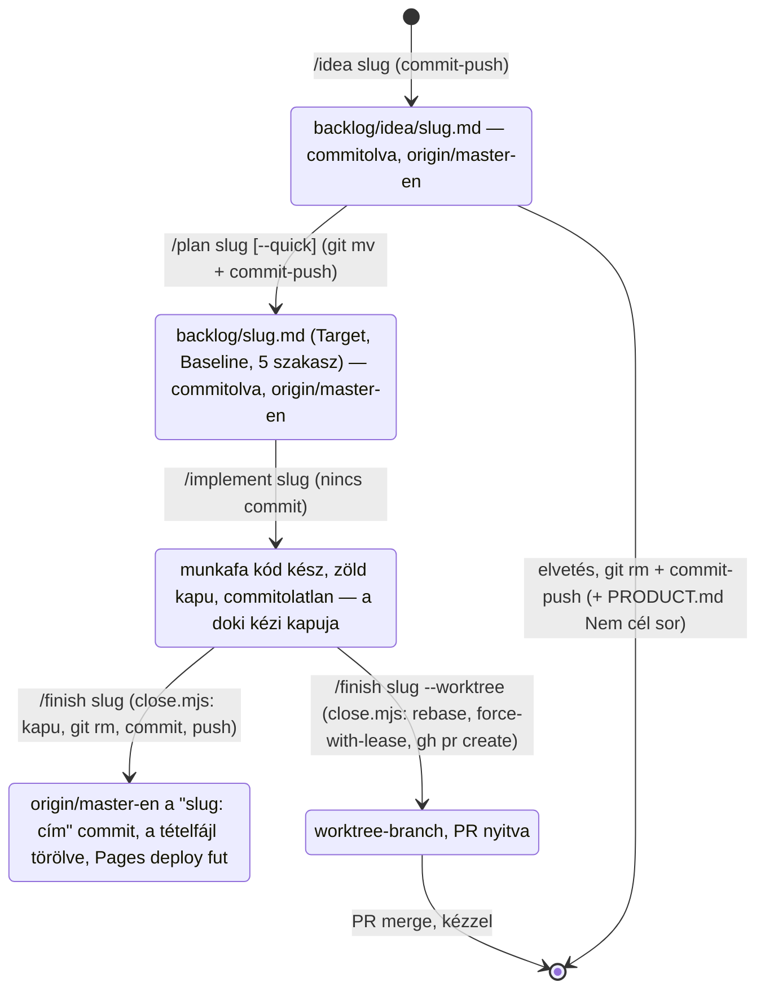

# A backlog-kezelési flow — fejlesztői leírás

Ez a fájl a fejlesztőnek (és egy későbbi review-agentnek) írja le, hogyan él egy tétel a
`backlog/` mappában az ötlettől a lezárásig: melyik skill mit csinál, mit nem csinálhat, melyik
script melyik git-lépést végzi, és melyik gépi őr mit fog meg. **Nem agent-context** (egyik
`CLAUDE.md` sem tölti be), és **nem tétel** — a `docs-check` és a `/backlog` a `CLAUDE.md`-vel
együtt kihagyja.

Igazságforrások, ha ez a leírás és a valóság eltér: a git-lépéseket a `scripts/workflow/*.mjs`
végzi (a `--help` a szerződés), a skill *ítéletet igénylő lépéseit* a `.claude/skills/*/SKILL.md`,
a tétel *alakját* a `backlog/CLAUDE.md`, a gépi szabályokat a `scripts/docs-check.mjs`. Ez a fájl
a köztük lévő szándékot rögzíti; skill- vagy script-változásnál frissítendő.

---

## 1. A modell egy bekezdésben

Egy fájl = egy tétel, a fájlnév a kebab-case `slug`, ami az első sor (`# <slug>`) és minden
későbbi parancs azonosítója is. **A státusz a mappa:** `backlog/idea/<slug>.md` ötlet,
`backlog/<slug>.md` a gyökérben tervezett (implementálható). Nincs `Status:` sor, index, sorszám.
Prioritás van, de csak a dokié: opcionális `Prio: now|next|later`, amit skill sosem ír magától.
Az állapotváltás egyetlen `git mv`; a kész tétel törlődik, nem „done"-ra kerül; a történet a git
history. **Minden állapotváltozás azonnal commit + push** — a backlog megosztott állapot, nincs
untracked tétel és nincs a helyi masteren várakozó commit. Elvetett irány sem marad itt: egy sor
a `docs/PRODUCT.md` Nem cél szakaszába, „nem X, amíg Y" alakban.

| | `idea/<slug>.md` (ötlet) | `<slug>.md` a gyökérben (tervezett) |
|---|---|---|
| Kötelező fejléc | `# <slug>`, `Type:` | `# <slug>`, `Type:`, `Target: master`, `Baseline: <40 hex>` |
| Opcionális fejléc | `Source:`, `Kerdes:`, `Prio:` | `Source:`, `Prio:` (a `Kerdes:` törlődik, ha a tervezés megválaszolta) |
| Törzs | egy bekezdés | `## Goal / Current state / Approach / Decisions / Verification` |
| Budget | ≤ 1500 karakter | ≤ 6000 karakter |
| `Type` | `feature` · `bug` · `chore` · `doki` | `feature` · `bug` · `chore` (`doki` itt tilos) |

`Type` jelentése: `feature` új viselkedés; `bug` reprodukálható hiba; `chore` kód-housekeeping,
refactor, őr-erősítés; `doki` emberi teendő, adatmunka — mindig `idea/` alatt marad, sosem
tervezhető. A fejléc-kulcsok, a `Prio` értékkészlete és a budgetek forrása:
→ symbol:scripts/docs-check.mjs#BACKLOG_HEADER_KEYS; symbol:scripts/docs-check.mjs#BACKLOG_PRIO; symbol:scripts/docs-check.mjs#BACKLOG_BUDGET

---

## 2. Életciklus

Minden nyíl egy skill, minden állapot egy megfigyelhető git-állapot. Az egyetlen commitolatlan
állapot a `Kesz`: itt ellenőriz a doki a munkafán (`npm run dev`), mert a következő lépés commitol
és azonnal az `origin/master`-re pushol — a master-push pedig a GitHub Pages mockupot élesíti.

---

## 3. A scriptek szerződése

Node ESM, a repó gyökeréből: `node scripts/workflow/<parancs>.mjs`, mindnél `--help`. Magyar
hibaüzenet, `✗`-szel, nem nulla exit code; egyik sem force-pushol a masterre, egyik sem
`--abort`-ol rebase-t, egyik sem old fel konfliktust.

| Script | Mit csinál | Megáll (exit 1), ha |
|---|---|---|
| `sync.mjs [--gate]` | `git fetch`; ff-merge az `origin/master`-re; ha `origin/master..HEAD` nem üres (csak megbukott push lehet): push; kiírja a HEAD SHA-t. `--gate`: push előtt teljes kapu — kézzel lezárt rebase után kötelező | nem `master`; félbehagyott rebase; divergencia; ff-merge ütközik commitolatlan fájllal |
| `commit-push.mjs -m … [--body …] [--trailer …]… -- <path>…` | csak a megadott path-ok stage-elése (átnevezésnél mindkettő; már `git rm`-elt path elfogadott); `docs-check`; commit; push. Nem-ff push: `rebase --autostash`, `docs-check` újra, push | nincs változás a path-okon; piros docs-check; rebase-konfliktus (félben marad, teendő: feloldás, `git rebase --continue`, `sync.mjs --gate`) |
| `drift.mjs <slug> [--set] \| --all` | a terv `Baseline`-ja és HEAD közt `git diff --stat -- app data assets`; exit 0 nincs drift, **exit 2** drift (a stat kiírva). `--set`: `Baseline` = HEAD. `--all`: minden tervezett tételre `slug<TAB>ok\|drift` | nincs tervezett fájl; hibás/ismeretlen `Baseline` |
| `close.mjs <slug> --title … [--body …] [--trailer …]…` | masteren: fetch + ff; a tételfájl megléte (különben „máshol lezárták"); **teljes kapu**; `git rm backlog/<slug>.md`; `git add -A`; commit `<slug>: <cím>`; push (nem-ff: rebase, **kapu újra**, push). Nem-master branchen: commit után `rebase origin/master` (base-változásnál kapu újra), `push --force-with-lease -u`, `gh pr create` ha nincs PR | a tételfájl hiányzik vagy követetlen; piros kapu; rebase-konfliktus |

A kapu = `npm run build`, `lint`, `test`, `docs-check` az `app/` alatt, sorban. Egy elv áll
minden script mögött: **ha a tesztelés óta változott a base, a kapu újra fut**; a
`commit-push` csak backlog/docs fájlt visz, ott a `docs-check` a kapu.

→ file:scripts/workflow/lib.mjs; file:scripts/workflow/sync.mjs; file:scripts/workflow/commit-push.mjs; file:scripts/workflow/drift.mjs; file:scripts/workflow/close.mjs

---

## 4. A skillek szerződése

Mindegyiknél ugyanaz a hat mező. A lépések részletei a hivatkozott fájlban.

### `/idea <slug> [szöveg | forrás-fájl]`

- **Bemenet:** kebab-case slug, és vagy egy-két mondat, vagy egy forrás-fájl (pl. review-jelentés),
  vagy semmi (akkor a beszélgetés a forrás). Többötletes forrásnál ötletenként javasol slugot, a
  felhasználó választ.
- **Előfeltétel — megáll, ha:** létező tétel (a két mappa slugjai vagy `Source:` sorai) már fedi a
  felvetést. Nem cél / hard invariáns ütközést kimond, de a tétel felvehető.
- **Létrehoz/mozgat:** `backlog/idea/<slug>.md` a teljes tartalom bemutatása és jóváhagyás után,
  majd `commit-push.mjs -m "backlog: +<slug>"`. `Prio:` csak akkor, ha a doki kimondta.
- **Soha nem:** ír app-kódot, tervez, ír magától `Prio`-t, kerül meg megbukott scriptet kézi `git`-tel.
- **Hol áll meg:** a commit az `origin/master`-en.
- **Következő:** `/plan <slug>`, egyértelmű bugnál `/plan <slug> --quick`.

→ file:.claude/skills/idea/SKILL.md

### `/plan <slug> [--quick]`

- **Bemenet:** létező `backlog/idea/<slug>.md`, vagy szabad felvetés (akkor a fájlt is ez hozza
  létre, az `/idea` dedup-lépésével).
- **Előfeltétel — megáll, ha:** `Type: doki`; a slug már a gyökérben van; a `sync.mjs` megáll; a
  sync után a gyökérben már ott a `backlog/<slug>.md` (párhuzamos session). Kötelező olvasmány:
  `docs/PRODUCT.md`, a root `CLAUDE.md` hard invariánsai, az érintett nested `CLAUDE.md`.
- **Létrehoz/mozgat:** interjú ág-onként; `sync.mjs` (a kiírt HEAD a `Baseline`); `git mv` az
  `idea/`-ból a gyökérbe, a fájl újraírása (`Target`, `Baseline`, 5 szakasz; `Prio` megmarad, ha
  volt); `commit-push.mjs -m "backlog: plan <slug>" -- <régi> <új>`. `--quick` csak `Type: bug`-nál.
- **Soha nem:** ír app-kódot, szignatúrát, típust; nem nyúl más tételhez; nem ír `Prio`-t.
- **Hol áll meg:** a tervfájl commitolva az `origin/master`-en.
- **Következő:** `/implement <slug>`.

→ file:.claude/skills/plan/SKILL.md

### `/implement <slug> [--worktree]`

- **Bemenet:** `backlog/<slug>.md` a gyökérben (commitolt).
- **Előfeltétel — megáll, ha:** a fájl nincs a gyökérben; `Type: doki`; a `git status` idegen
  commitolatlan módosítást mutat (a `close.mjs` mindent commitol, ezért kell tiszta fa); a
  `sync.mjs` megáll. Preflight: `drift.mjs <slug>` — exit 2-nél a `Current state` pointereit
  átnézi, megáll, ha a plan döntése nem áll meg, különben `drift.mjs <slug> --set`.
- **Létrehoz/mozgat:** app-kód és teszt a plan scope-jában; a kapu zöldig.
- **Soha nem:** bővíti a scope-ot, nem javít idegen hibát, **nem commitol**.
- **Hol áll meg:** zöld kapu, commitolatlan munkafa. A jelentés: mi valósult meg; a `Verification`
  mely tételei teljesültek; **számozott kézi tesztlista a dokinak**; a mondat, hogy a `/finish`
  azonnal pushol és élesít.
- **Következő:** a doki kézi ellenőrzése a munkafán, majd `/finish <slug>`.

→ file:.claude/skills/implement/SKILL.md

### `/finish <slug> [--worktree]`

- **Bemenet:** kódszinten kész, **kézzel már ellenőrzött** tétel.
- **Előfeltétel — megáll, ha:** a kapu vagy a `docs-check` piros és nem javítható; a plan
  manual-check szelete a tételhez tartozó találatot ad (javítás itt, kapu újra); a `close.mjs`
  megáll (tételfájl hiányzik = máshol lezárták; rebase-konfliktus).
- **Létrehoz/mozgat:** dokumentáció **csak ha kell** (a default „nincs docs-diff"): termékszándék →
  `docs/PRODUCT.md`; discovery → nested `CLAUDE.md`, egy állítás egy sor, anchorral. Utána
  `close.mjs <slug> --title "<cím>"`: teljes kapu, `git rm` tételfájl, minden munkafa-változás
  (a manual-check jelentés is), commit `<slug>: <cím>`, push.
- **Soha nem:** kerüli meg a scriptet kézi commit/push-sal; nem visz át tervfájl-tartalmat; nem
  hívja automatikusan az `/update-changelog`-ot vagy `/update-features`-t.
- **Hol áll meg:** a commit az `origin/master`-en, a Pages deploy fut. A jelentés: mi valósult
  meg; a commit SHA; volt-e docs-diff; emlékeztető a két docs-skillre.
- **Következő:** nincs; a tétel útja itt ér véget.

→ file:.claude/skills/finish/SKILL.md

### `/backlog`

- **Bemenet:** nincs. **Előfeltétel:** nincs; csak olvas.
- **Létrehoz/mozgat:** semmit. Két tábla (`slug | Prio | Type | Kerdes | első mondat`): gyökér,
  aztán `idea/`, mindkettőn belül `now → next → later → nincs Prio`; a `Type: doki` külön;
  összesítés; a gyökér tételeinél `drift.mjs --all` → `baseline elmozdult` jelzés; hibás fejléc
  külön. A végén **legfeljebb 3 indokolt javaslat** `Prio` nélküli tételre, „a doki dönt" zárással.
- **Soha nem:** módosít fájlt, nem fetchel, nem ír `Prio`-t.

→ file:.claude/skills/backlog/SKILL.md

---

## 5. Bemenetek: a review-skillek

Egy közös szabály: **a review jelent, nem ír a backlogba és nem módosít app-kódot.** A jelentés
`docs/reviews/YYYY-MM-DD-<típus>[-<slug>].md`, a mappa **append-only** (minden futás dedup- vagy
összehasonlítási forrás a következőnek; csak képernyőkép-mappa törölhető), és a futás végén
`commit-push.mjs -m "review: <típus> … <dátum>"`. A záró üzenet a súlyos találatokra kész
parancssort ad — `/idea <javasolt-slug> docs/reviews/<jelentés>` — dedup-jelzéssel; a backlogba
így egy írói út van, a doki jóváhagyásával.

- **`/doctor-review [scenario-slug]`** — István-persona bejárás izolált Chrome-ban. `/idea`-sor
  minden `ÚJ`/`ISMÉT` **Blokkoló** és **Súlyos** megállapításra; `Közepes`/`Kis` a jelentésben marad.
- **`/arch-react-review`** — architektúra + React lencse, az előző jelentéssel összevetve. `/idea`-sor
  minden **Critical**/**Major** `NEW` megállapításra.
- **`/manual-checks <pdf | visual-css | keyboard-a11y | all>`** — a jsdom által nem fedett réteg.
  `/idea`-sor a `Kritikus` találatokra. A `/finish` 3. lépéséből hívva nincs külön commit (a
  `close.mjs` viszi a jelentést), és a tételhez tartozó találatot ott a `/finish` javítja.

→ file:.claude/skills/doctor-review/SKILL.md; file:.claude/skills/code-and-architecture-review/SKILL.md; file:.claude/skills/manual-checks/SKILL.md

---

## 6. A gépi őr: `docs-check`

`npm run docs-check` az `app/` alól (vagy `node scripts/docs-check.mjs` a gyökérből), a CI-ban, a
`commit-push` és a `close` előtt. A `backlog/` alatt rekurzívan minden `.md`-t átnéz, a státuszt az
útvonalból dönti el — kivéve a `CLAUDE.md`-t és ezt a `README.md`-t. Bármely találat exit 1,
allowlist nincs.

**Amit megfog (tételfájlon):** a fájlnév kebab-case slug és az 1. sor `# <slug>`; a slug egyedi a
két mappa között; a fejléc csak `Type`, `Source`, `Kerdes`, `Prio`, `Target`, `Baseline` kulcsot
tartalmaz (`Status:` hiba); `Type` a négy érték egyike, a gyökérben `doki` tilos; `Prio` csak
`now|next|later`; a gyökérben `Target: master`, `Baseline: <40 hex>` és az öt szakasz kötelező,
`idea/` alatt `Target`/`Baseline` tilos; budget 1500 / 6000; sehol D-szám vagy legacy-útvonal.

**Amit nem fog meg:** a `Current state` pointereit nem oldja fel — az elavulást a `drift.mjs` +
az `/implement` preflightja fogja; szemantikai igazságot nem bizonyít. Anchorokat (nyíl után
`file:` / `symbol:` / `test:` / `product:`) a context-fájlokban (`CLAUDE.md`-k, `AGENTS.md`,
`docs/PRODUCT.md`) és ebben a README-ben old fel — ezért egy script- vagy skill-átnevezés itt
pirosat ad.

→ symbol:scripts/docs-check.mjs#backlogStatus; symbol:scripts/docs-check.mjs#backlogTetel

---

## 7. A `--worktree` ág (párhuzamos sessionök)

Alapértelmezés: minden a helyi `master`-en, worktree és PR nélkül. A `--worktree` akkor kell, ha
két session párhuzamosan dolgozik két tételen.

- **`/implement <slug> --worktree`:** validáció a fő könyvtárban; `EnterWorktree` — friss branch
  `origin/master`-ről `.claude/worktrees/<slug>` alatt (a tervfájl commitolt, tehát benne van);
  `cd app && npm install`; a sync kimarad; preflight (`drift.mjs` a branchen is működik),
  implementáció, kapu változatlan.
- **`/finish <slug> --worktree`:** ugyanaz a `close.mjs`, ami a nem-master branchen commit után
  `rebase origin/master` (base-változásnál kapu újra; konfliktusnál megáll, a doki oldja fel és
  újra `/finish --worktree`), `push --force-with-lease -u`, `gh pr create --base master`. A PR
  merge kézi; a Pages a merge után frissül.

---

## 8. Lezárás után, kézzel

- **`/update-changelog`** — laikus nyelvű, dátumozott `docs/CHANGELOG.md`-bejegyzés; **`/update-features`**
  — a `docs/FEATURES.md` képernyőnkénti pillanatképe. Mindkettő külön, kézi hívás, megerősítés
  után ír, és a végén `commit-push.mjs`-sel commitol + pushol. A `/finish` csak emlékeztet rájuk.
- **Elvetés.** `git rm backlog/idea/<slug>.md` + `commit-push.mjs -m "backlog: -<slug>"`; ha az
  elvetés termékszintű, egy sor a `docs/PRODUCT.md` Nem cél szakaszába, ugyanabban a commitban.
  → product:#nem-cel

---

## 9. Egy tétel útja (fiktív `pelda-slug`)

| # | Parancs | Fájlrendszer | git | Megáll? |
|---|---|---|---|---|
| 1 | `/idea pelda-slug "A doki…"` | `backlog/idea/pelda-slug.md` | commit `backlog: +pelda-slug`, push | jóváhagyásnál |
| 2 | `/plan pelda-slug` | interjú → `git mv` → `backlog/pelda-slug.md` | `sync`; commit `backlog: plan pelda-slug`, push | ág-onként; a végleges tartalomnál |
| 3 | `/implement pelda-slug` | `app/src/**` kód + teszt | `sync`; `drift`; kapu zöld; **nincs commit** | idegen módosítás; drift, ami a plan döntését dönti |
| 4 | *(doki)* kézi teszt a munkafán, a számozott lista szerint | — | — | — |
| 5 | `/finish pelda-slug` | manual-check szelet, ha a plan kéri; docs csak ha nem levezethető; a tételfájl törlődik | `close`: kapu, commit `pelda-slug: <cím>`, **push** → Pages | kapu piros; máshol lezárták; rebase-konfliktus |
| 6 | `/update-changelog`, `/update-features` — ha doki-látható | `docs/CHANGELOG.md`, `docs/FEATURES.md` | commit + push | megerősítésnél |

Bug-sáv: a 2. lépés `--quick`. Párhuzamos session: a 3. és 5. lépés `--worktree`-vel, PR-en zár.

---

## 10. Tervezési elvek

| Elv | Miért | Kikényszeríti |
|---|---|---|
| A státusz a mappa, nincs `Status:` sor | két igazságforrás szétcsúszna; a `git mv` atomi | `docs-check` fejléc-szabály; `/plan` `git mv` |
| Fájl = tétel, slug = azonosító | index és számláló konfliktus forrása | `docs-check` slug-egyediség; minden skill `<slug>`-ot vár |
| **Minden állapotváltozás azonnal commit + push** | untracked tétel, várakozó commit-sor és két baseline-referencia mind ebből nőtt ki; a git history csak akkor történet, ha a tétel benne van | `commit-push.mjs`, `close.mjs`; a skillek nem kerülik meg kézi `git`-tel |
| **A kézi kapu a munkafa, a `/finish` előtt** | a master-push Pages-re élesít; ami commitolt, az megosztott | `/implement` jelentése (tesztlista); `/finish` bevezetője |
| Nincs branch/PR alapból | egy fejlesztő; a PR-koreográfia költsége nagyobb, mint a haszna; a Pages mockup demó adattal fut | `close.mjs` master-mód; `--worktree` csak párhuzamos sessionre |
| Base-változás után a kapu újra | tiszta rebase is összefésül nem tesztelt kombinációt | `pushMaster({ regate })`, `close.mjs` branch-mód |
| Drift = app-kód diff, nem SHA-egyezés | a backlog-commitok minden tervet „elmozdult"-nak mutatnának | `drift.mjs` |
| `Prio` a dokié, a skill legfeljebb javasol | az agent ne priorizáljon a doki helyett, de a lista ne fejben éljen | `docs-check` értékkészlet; `/backlog` ≤ 3 javaslat; `/idea`, `/plan` nem ír `Prio`-t |
| Ötlet és terv sosem ír app-kódot | a „mintakód" is döntés | `/idea`, `/plan` Korlátok |
| `/implement` nem bővít scope-ot, nem commitol | olvasható commit; a doki előbb a munkafát nézi | `/implement` 4., 6. |
| Review-skill csak jelent, egy írói út a backlogba | a review megállapít, a döntés (felvesz-e tételt) a dokié; kivétel nélkül | mindhárom review-skill Lezárása; `/idea` a jóváhagyással |
| `docs/reviews/` append-only, commitolva | dedup- és összehasonlítási forrás; a történet ne a lemezen éljen | review-skillek `commit-push` lépése |
| Kész tétel törlődik, nincs napló | a git history a történet | `close.mjs` `git rm`; `docs-check` legacy-ref |
| Dokumentáció default nem íródik | ami kódból levezethető, ott igaz; a context-budget véges | `/finish` 4.; `docs-check` budget és anchor |
| Determinisztikus lépés scriptben, ítélet a skillben | a git-koreográfia szabad szövegben ígéret volt, nem bizonyíték; más agent is hívhatja | `scripts/workflow/*`, `AGENTS.md` |

---

## 11. A 2026-09-05-i review és ami lett belőle

Egy külső agent kritikája (`docs/reviews/2026-09-05-backlog-flow-review.md`) és e fájl korábbi
T1–T7 feszültség-listája ugyanazt találta: a git-állapotátmenetek nem voltak kimondva. Döntések:

| Pont | Döntés |
|---|---|
| Tételfájl életciklusa (T1, T3, T4) | **átvéve** — `/idea`, `/plan` commit + azonnali push |
| Helyi master mint push-queue; tételspecifikus push | **feloldva** — nincs várakozó commit, a `/push-backlog-item` megszűnt |
| Branch/worktree + PR alapértelmezés; CI a PR-en | **elvetve** — master marad, a kézi kapu a munkafára került; a `--worktree` ág megmaradt párhuzamos sessionre |
| Baseline két referenciája (T2) | **átvéve** — egy referencia (HEAD == origin/master), drift = app-diff |
| Kapu rebase után (T7) | **átvéve** — minden base-változás után |
| Prioritás | **átvéve, módosítva** — opcionális `Prio`, a doki írja, a `/backlog` legfeljebb 3 javaslatot tesz |
| Review-skillek egységesítése (T5, T6) | **átvéve** — csak jelentés, nincs kódjavítás, `docs/reviews/` append-only és commitolt |
| Koreográfia, igazságforrás | **átvéve** — scriptek + vékonyabb skillek |
| Hordozhatóság | **átvéve** — `AGENTS.md` + agentfüggetlen scriptek |
